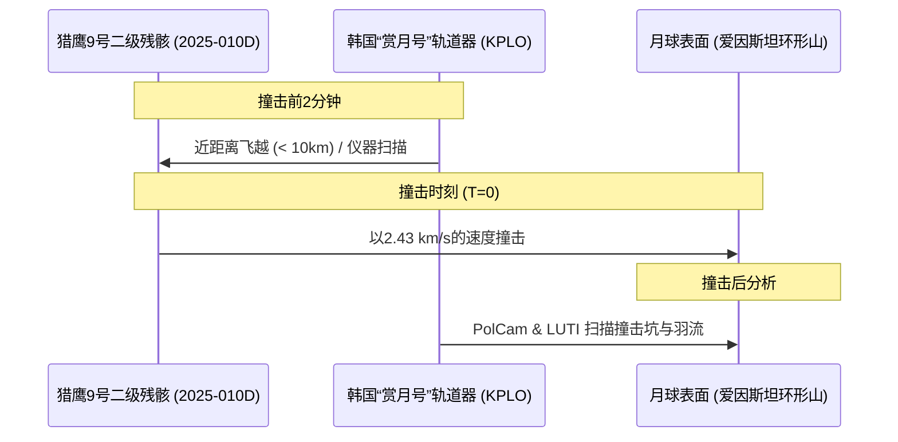

# 猎鹰9号残骸撞月倒计时：2025-010D“深空失控”撕开月球轨道监管真空

2026年8月5日 UTC 时间 06:35 左右，一个重达4.5吨、由航空级铝材和排空燃料箱构成的金属圆筒，将以2.43公里/秒（约合时速8690公里）的速度，狠狠砸向月球西侧边缘的爱因斯坦环形山（Einstein Crater）。在撞击的瞬间，这枚废弃的 SpaceX 猎鹰9号火箭二级遗留物——官方编号 **2025-010D**（NORAD ID **62719**）——将彻底汽化。据物理模型估算，这场碰撞将瞬间释放约145亿焦耳的动能，在月表轰出一个直径20至30米的新陨石坑，激起的月壤羽流高度预计可达75至100公里。

在行星科学家眼中，这无异于一场“天赐的狂欢”。来自 NASA 艾姆斯研究中心和洛斯阿拉莫斯国家实验室的科研团队已经为此模拟演练了数周，并与 NASA 的月球勘测轨道器（LRO）以及韩国的“赏月号”（Danuri/KPLO）月球轨道器密切协同，准备在撞击前后对抛射物进行光谱分析。

然而，在轨道安全倡导者看来，这次撞击却是一记刺耳的警钟。

这枚火箭推进器于2025年1月15日发射，在将 Firefly Aerospace 的 *Blue Ghost-1* 和 ispace 的 *Resilience* 着陆器送入太空后，便被遗弃在了一条高度椭圆的“跨月”轨道上。在随后的18个月里，其行踪完全受控于混乱的“地-月-日”三体引力动力学和微弱的太阳辐射压力。令人感到警惕的是，预测此次撞击的核心轨道数据，竟然不是来自官方的航天监测网，而是依赖一个由业余天文学家和单一独立开发者组成的去中心化网络。随着商业地月轨道交通的呈指数级增长，这一事件将深空追踪与监管的巨大真空彻底暴露在聚光灯下。

### 三体引力弹球：混沌的深空动力学
一枚原本只是为了投送月球着陆器的火箭二级，为何会在18个月后戏剧性地撞向月球？答案隐藏在限制性三体问题（地球-月球-太阳）的复杂物理机制，以及太阳辐射压力（SRP）持续不断的微小扰动之中。

当猎鹰9号二级推进器执行跨月轨道入射（TLI）点火后，它会将载荷推向月球。载荷分离后，失去控制的推进器便被留在了高地球轨道（HEO）上。与低地球轨道（LEO）不同——在低轨道上，大气阻力是可预测的，它会像刹车一样最终拉低垃圾使其坠入大气层烧毁——而高地球轨道则是一个充斥着引力变数的地带。

```
                  太阳辐射压力 (SRP)
                            \ \ \ \ \
                             v v v v
      [地球] <================== 废弃火箭残骸 (翻滚中) ==================> [月球]
                             ^
                             | 
                        三体引力扰动
```

在这18个月的漂移过程中，物体 2025-010D 曾多次与月球近距离擦肩而过。每一次相遇都像是一次“重力弹弓”，改变了这枚推进器的轨道倾角、偏心率和半长轴。在较长的时间跨度下，预测这些变化在技术上面临两大棘手瓶颈：
1. **三体混沌效应**：该动力学系统对初始条件极度敏感。推进器初始速度向量哪怕只有极其微小的误差，在经过几次轨道运行后，都会累积并分化出巨大的轨迹偏差。
2. **太阳辐射压力（SRP）**：废弃的推进器是一个长13.8米、直径3.7米的空心大圆筒，具有极高的面积质量比（$A/m$）。当它在太空中无规则翻滚时，迎光面的面积在动态发生变化。光子撞击金属表面产生的微弱推力足以改变其轨迹。在无法精确得知其旋转状态和表面反射率的情况下，对其受力模型的模拟只能粗略估算。

“冥王星项目（Project Pluto）”轨道追踪软件的开发者、天文学家比尔·格雷（Bill Gray）一直是修正这些模型的主要研究者。他在其追踪博客上写道：“对于这些高轨道太空垃圾，你必须时刻与太阳辐射压力作斗争。因为推进器在翻滚，它捕捉的阳光量不断变化，产生微弱但极难预测的力，这会使其轨道偏离纯粹的开普勒轨道。”

### 深空追踪真空：雷达失效下的光学“盲区”
美国军方的空间监视网（SSN）目前追踪着轨道上超过4.5万个物体。然而，其现有的传感器阵列在设计之初就高度偏向于服务 LEO（低轨）和 GEO（地球同步轨道）。作为低轨追踪主力军的地面雷达，受制于雷达方程的物理极限——回波信号强度以距离的四次方（$1/r^4$）呈断崖式衰减。当目标进入距离地球约40万公里的地月空间时，雷达回波已几乎衰减为零。

因此，深空空间态势感知（SSA）目前几乎完全依赖光学望远镜。但光学追踪面临着极其严苛的物理限制：
- **相位角与强光干扰**：当物体靠近月球时，往往会直接湮没在亮晃晃的月面反光或强烈的太阳光晕中。
- **天气与视宁度度**：地面望远镜完全受制于地球上的阴晴雨雪以及昼夜交替。

正是因为这些局限，物体 2025-010D 在这18个月的旅程中曾多次“失联”。它曾多次被巡天猎手网络（如卡塔琳娜巡天系统或Pan-STARRS）重新发现，并一度被误认为是一颗新发现的近地小行星，直到科研人员将轨道数据进行交叉比对，才最终确认其“猎鹰9号残骸”的身份。

哈佛-史密森天体物理学中心的天体物理学家乔纳森·麦克道尔（Jonathan McDowell）曾在社交媒体平台 X 上对此犀利批判：
> “我们拥有价值数十亿美元的空间追踪基础设施，但对地球同步轨道以外的任何东西几乎都是睁眼瞎。我们居然要依靠业余小行星猎手来跟踪数吨重的商业太空垃圾。随着阿耳忒弥斯计划和商业着陆器推动地月轨道交通不断升级，这无异于一场迟早会发生的事故。”

### 立体观测网：科学家眼中的“天赐实验”
虽然轨道安全专家忧心忡忡，但行星科学家们正试图将这场碰撞转化为一次科学机会。由于撞击物体的质量、速度和入射角度都是已知且固定的，这次撞击相当于一次完美的、经过校准的月震与光谱物理实验。

为此动用的观测阵容堪称豪华。韩国航空宇宙研究院（KARI）计划操纵其**“赏月号”（Danuri）**轨道器进行一次高风险的轨道调整。按照目前的规划，在撞击发生前仅2分钟，“赏月号”将在距离这枚翻滚的猎鹰9号残骸仅数公里的高度飞越，完成最后的空中定格。



为了记录这次撞击，科学家部署了多维度的传感器阵列：
- **“赏月号”广角偏振相机（PolCam）**：该仪器将测量抛射物羽流反射光的偏振度。由于偏振状态对尘埃颗粒的尺寸和形状高度敏感，科学家将能借此剖析从月表数米深处被掀起的深层月壤的物理特性。
- **“赏月号”阴影相机（ShadowCam，NASA资助）**：虽然该相机主要用于窥探永久阴影区，但其超高灵敏度的光学器件届时将锁定撞击区域，捕捉微弱的初始撞击闪光和尘埃云的几何轮廓。
- **LRO 莱曼阿尔法测绘项目（LAMP）**：NASA 的紫外光谱仪将背靠漆黑的太空背景，分析抛射物羽流的光谱线。LAMP 将重点搜寻被撞击热量释放出来的、原本封存在月壤中的挥发性化合物——例如水蒸气、羟基（OH）以及稀有气体。
- **LRO 月球勘测轨道器相机（LROC）**：其窄角相机（NAC）将对爱因斯坦环形山区域进行撞击前后的亚米级分辨率成像，以精确测定撞击点的物理坐标，并勾勒出新陨石坑的几何形态。

### 规则真空：谁为地月轨道“野蛮生长”买单？
目前约束地月空间的法律框架，几乎如同地月空间本身一样，是一片苍白的真空。

根据1967年通过的《外层空间条约》，各国对本国（包括商业实体）在空间开展的活动承担国际责任。然而，国际上至今没有针对地月空间废弃航天器“终老处置”的任何约束性行业指南。机构间空间碎片协调委员会（IADC）为低轨（2000公里以下）和同步轨道（GEO +/- 200公里）定义了受保护的轨道区域，要求卫星在退役后必须主动坠毁或移至“墓地轨道”。然而，地月空间、拉格朗日点（L1至L5）以及绕月轨道，目前不受任何类似条款的保护。

这种政策的缺失，正带来实实在在的商业风险。如果一枚废弃的火箭推进器砸中了历史性的月球遗址（如阿波罗登月点），或是正在运行的活跃基础设施（如中国的嫦娥系列着陆器或 NASA 筹建中的月球“门户”空间站），究竟该由谁来承担责任？尽管根据1972年《空间责任公约》，发射国应对其空间物体造成的损害承担赔偿责任，但在一个不属于任何国家主权的领土上，如何去界定“损害”本身，就是一个法学上的乱麻。

德克萨斯大学奥斯汀分校副教授、Privateer Space 首席科学家莫里巴·贾（Moriba Jah）博士一直痛陈将地月空间当成“深空垃圾场”的危险性。他在社交平台 Reddit 上直言：
> “问题在于，发射服务商简单地把地月轨道当成了‘天然墓地’。但这些轨道本身极其不稳定。深空中的墓地轨道只是一个临时停放点，三体系统混沌的引力助推随时会将这些物体重新抛回地球、砸向月球，或是甩进正在使用的繁忙航天通道。我们迫切需要强制性的处置协议——要么使用剩余燃料将残骸推入日心轨道，要么进行可控的定向撞击坠毁。”

然而，推行受控处置对于发射商而言意味着牺牲运载能力。若想在跨月轨道入射（TLI）点火后将猎鹰9号二级残骸推入绕日轨道，必须预留足够的引擎重启燃料和每秒数百公里的增量速度（Delta-V）。对于那些在极低利润率下挣扎的商业发射商而言，多带一公斤燃料，就意味着要减少一公斤留给客户着陆器的载荷额度。在缺乏统一多边监管政策的情况下，没有任何一家商业公司会甘愿主动吞下这个性能亏空。

随着人类的月球探索从零星的科学探测跃升为常态化的工业运载，月球周围的轨道通路只会变得日益拥挤。2025-010D 即将在8月5日迎来的谢幕一撞，正无声地提醒着我们：月球已不再是那个无人问津的寂静荒野。它是人类轨道扩张的下一个前沿，而我们甚至还没站稳脚跟，就已经把通往那里的路铺满了垃圾。
