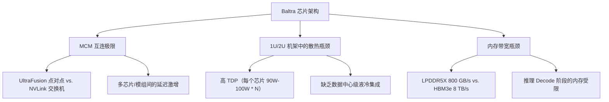

# **硅谷大买收：独家解密苹果急寻芯片初创公司，欲如何拯救延期的“Baltra”AI服务器芯片？**

一直以来，苹果在芯片开发上都遵循一种“慢工出细活”的内生式策略：收购一家小型的 IP 供应商，招募几十名工程师，然后花上数年时间，打磨出一个垂直整合的芯片巨头。然而，生成式 AI 的淘金热并不等苹果。

2026年7月15日，《The Information》报道称，苹果正在积极探索对半导体初创公司的收购。其目的十分明确：拯救其代号为“Baltra”且已陷入延期的自研 AI 服务器芯片路线图。Baltra 原计划为 Apple Intelligence 强大的云端端侧推理提供核心动力，但如今其发布时间已经错过了原定的 2026 年窗口。

这一延期的蝴蝶效应已经显现在苹果的算力基础设施中。苹果现有的数据中心集群基于消费级的 [M2 Ultra](file:///Users/vzl/.gemini/antigravity-cli/brain/d62f9714-c0e8-4c33-bdac-70f26a689878/apple_baltra_investigation.md) 芯片构建，在运行下一代生成式大模型时已触及性能天花板。为此，苹果不得不做出巨大的战略妥协：将 Siri 全新的、由 Gemini 驱动的 Agent 功能，路由至托管在 Google Cloud（谷歌云）上的 Nvidia Blackwell GPU 算力群。

要剖析苹果自研芯片引擎为何“熄火”，我们需要深入其服务器设计的物理与架构底层。



### 物理层面的 Baltra 瓶颈

苹果芯片（Apple Silicon）在消费端（客户端）堪称工程杰作，但服务器端芯片完全是另外一头猛兽。Baltra 正在遭遇三大致命的架构瓶颈：

#### 1. 多芯片模组（MCM）的互连极限
苹果在台式机芯片（如 Ultra 系列）上的扩展依赖于其独家的 **UltraFusion** 技术。这是一种基于无源硅中介层（Passive Silicon Interposer）的超高密度封装技术。尽管 UltraFusion 能够在两个 Max 晶圆（Die）之间提供高达 2.5 TB/s 的双向带宽以合成为一颗“Ultra”芯片，但它无法高效地扩展到 4 Die 或 8 Die 的服务器级集群。

本质上，UltraFusion 是一种点对点（Point-to-Point）互连架构。在多 Die 配置中，数据路由需要在中介层网格中进行多次跳转（Multi-Hop）。由于缺乏像英伟达 **NVLink Switch** 这样的有源交换网络，当 Die 0 尝试访问 Die 3 上的内存时，路由延迟会急剧上升并产生巨大抖动。这种高延迟对极其注重 Token 生成速度的对话式 AI 而言是致命的。

#### 2. 高密机架中的散热瓶颈
苹果芯片的设计哲学是极致的能效比与低功耗。相反，数据中心机架则工作在空间极度受限且通风量有限的 1U/2U 机箱中。单颗 M2 Ultra 在满载下的持续 TDP 约为 90W 至 100W，但将多颗 Die 级联在同一个服务器节点内，会产生严重的局部热点。苹果的风冷服务器机箱并未集成类似英伟达 Blackwell 节点所使用的先进液冷系统，这导致苹果芯片在持续 100% 满载工作负荷下不得不频繁降频（Throttling）。

#### 3. 内存带宽的代差：LPDDR5X vs. HBM3e
在自回归的 Decode（解码）阶段，AI 推理的性能本质上严重受限于内存带宽。为了生成每一个 Token，系统必须以惊人的速度将数十亿个模型参数从内存流式传输到执行引擎中。
* **苹果的 LPDDR5X 统一内存：** 在 M2 Ultra 上能提供 800 GB/s 的带宽。
* **英伟达的 HBM3e 显存：** 在 Blackwell B200 GPU 上则能提供高达 8 TB/s 的带宽。

对于量化至 4-bit 的 70B（700亿参数）大模型，苹果的内存系统在面对高并发的多用户请求时会显得极其饥饿。用户端感受到的则是明显的响应卡顿，这逼迫苹果不得不将复杂的 Siri 任务分流至谷歌云的英伟达算力实例。

### 软件层面的“创可贴”：模型瘦身

为了尽可能地将推理任务留在内存受限的 LPDDR 服务器和边缘设备上，苹果在软件栈上做足了“瘦身”优化：

* **量化（Quantization）：** 将模型从 FP16 压缩至 INT4 甚至混合 3-bit。这虽然能让模型塞进 M 系列芯片的 RAM 中，但却付出了“量化税”——模型逻辑与推理精度的明显下滑。
* **结构化剪枝（Structured Pruning）：** 裁剪掉未激活的神经通路，以减少单次前向传播中的矩阵乘法次数。
* **动态 LoRA（Low-Rank Adaptation）：** 在内存中冻结一个单一的基座模型，并根据任务实时动态加载和切换仅有几兆字节的微型适配器。

尽管这让苹果得以为用户提供端侧轻量化任务，但面对复杂的逻辑推理和多步 Agent 工作流，依然必须依赖未量化的前沿大模型提供完整的算力支持。

### 300 亿美元的博通协同效应与并购大棋

2026年7月，苹果将其与博通（Broadcom）的自研芯片合作协议延长至 2031 年，交易规模超过 300 亿美元。在这项协议中，博通负责提供物理层 IP（PHY）、高速 SerDes、PCIe Gen 6/7 控制器以及封装协同设计，而苹果则专注于自研逻辑电路的设计。

```
+-------------------------------------------------------------------+
|                           苹果自研芯片                             |
|  - 自研神经网络引擎（NPU）核心逻辑电路                             |
|  - 统一内存控制器架构                                              |
|  - 软件编译器（MLX / CoreML）                                      |
+-------------------------------------------------------------------+
                                 |
                                 v (联合设计与集成)
+-------------------------------------------------------------------+
|                        博通 ASIC 平台                              |
|  - 物理层 IP（PHY）与 SerDes（PCIe Gen 6/7）                      |
|  - 自研网络与交换矩阵（Switching Fabric）架构                     |
|  - 先进封装与台积电 CoWoS 联合工程设计                             |
+-------------------------------------------------------------------+
```

那么，既然有了博通的加持，苹果为何还要积极寻求对初创公司的收购？
原因在于，从零开始设计一款服务器 ASIC 芯片需要耗时 3 到 5 年。通过收购半导体初创公司，苹果买的并非现成的物理芯片，而是**经过流片验证的 IP 资产与核心工程团队**。这些人才专精于高带宽内存（HBM）控制器、先进封装布局以及数据流编译器开发。这种人才与技术注入能让苹果跳过传统的流片迭代周期，从而加速 Baltra 与博通网络织锦的深度整合。

### 战略对比：苹果 PCC vs. 竞争对手

苹果的服务器基础设施策略与其他的云巨头形成了鲜明的对比：

| 评估维度 / 技术特性 | 苹果私有云计算 (PCC) | 谷歌云 (TPU 平台) | Meta (MTIA 基础设施) |
| :--- | :--- | :--- | :--- |
| **核心芯片** | M2 Ultra / Baltra (延期) | TPU v6 (Trillium) / 自研 ASIC | MTIA v2 / 英伟达 Blackwell |
| **互连织锦** | UltraFusion (MCM) / 博通网络架构 | 自研光路交换机 (OCS) | RoCE v2 / InfiniBand / NVLink |
| **内存系统** | 统一 LPDDR5X (800 GB/s) | HBM3e (每个 TPU 高达 4.8 TB/s) | LPDDR5 / HBM3e |
| **安全架构** | 无持久化安全飞地、加密分类账本 | 机密虚拟机 / Titan 信任根 | 标准企业云 |
| **云端依赖度** | 混合云 (谷歌云 / 英伟达 Blackwell) | 100% 自主掌控第一方 | 混合云 (AWS / 租用托管数据中心) |

为了在 Baltra 延期期间填补算力空白，苹果在谷歌云的 Blackwell 节点中部署了一套极其复杂的安全技术栈：
* **英伟达机密计算（Confidential Computing）：** 实现 GPU 内存中数据的硬件级加密。
* **Intel TDX：** 针对 CPU 虚拟机提供 Hypervisor 级别的物理隔离。
* **Google Titan：** 校验操作系统的密码学信任根。
* **可验证分类账本（Verifiable Ledger）：** 苹果公开发布在谷歌云上运行的软件密码学证明，使独立研究人员能够核实：即便使用了第三方基础设施，苹果的无持久化隐私承诺依然完好无损。

### 行业视点与争议

在 X.com 和 Reddit 等社交平台上，半导体技术社群对苹果服务器芯片面临的挑战展开了激烈的探讨。

*SemiAnalysis* 的 Dylan Patel 在谈到封装瓶颈时指出：
> “苹果的封装极限正在撞墙。UltraFusion 对消费级的小芯片（Chiplet）来说堪称完美，但它无法扩展到足以与英伟达 NVLink 或谷歌光路交换机（OCS）相媲美的多插槽、高带宽互连网络中。他们在互连延迟上大失血。”

*Moor Insights & Strategy* 的首席分析师 Patrick Moorhead 强调了两者在运营属性上的根本差异：
> “苹果正在意识到，数据中心芯片与消费级芯片是完全不同的两码事。你不能简单地把几颗 M2 Max 晶圆拼贴在一起，就指望能和英伟达的企业级网络及 HBM 内存子系统一决高下。”

在 Reddit 的 `r/MachineLearning` 板块，一位资深芯片工程师观察到：
> “Srouji 的团队在客户端 SoC 设计上确实封神，但他们缺乏构建分布式规模化（Scale-out）架构的实战经验。将 Siri 路由至谷歌云的 Blackwell 节点不仅是一次暂时的受挫，这在架构上证实了：企业级 AI 必须拥有 HBM 显存和先进的有源互连网络。”

3. 社盟推广摘要（Highlight）
3.1 核心问题
1. 苹果将 Siri 的 Gemini 代理功能路由至谷歌云上的英伟达 Blackwell，这是否突破了其“私有云计算”（PCC）的安全红线？
2. 在大模型推理时代，苹果引以为傲的 UltraFusion 点对点封装和 LPDDR 统一内存为什么在 HBM3e 面前败下阵来？
3. 苹果与博通签下 300 亿美元大单后，为何仍需通过“买团队”来拯救跳票的自研 AI 服务器芯片 Baltra？

3.2 摘要正文
苹果自研云端AI芯片Baltra延期，被迫做出重大战略妥协：将Siri由Gemini驱动的全新Agent功能路由至谷歌云的英伟达Blackwell GPU运行。社群热议这暴露出苹果芯片的三大硬伤：无源UltraFusion点对点封装在多Die架构下延迟激增，LPDDR5X的800GB/s带宽在HBM3e的8TB/s面前极度卡顿，且缺乏液冷导致100W的M2 Ultra级联时严重降频。为了保障隐私，苹果在谷歌云上强推以机密计算为主的私有云计算安全栈。为此，苹果与博通续签300亿美元大单的同时，急寻半导体初创公司以获取流片验证的IP和HBM开发团队，试图绕过3到5年的研发周期为自研芯片救火。

3.3 关键词标签
#苹果芯片 #英伟达Blackwell #私有云计算
