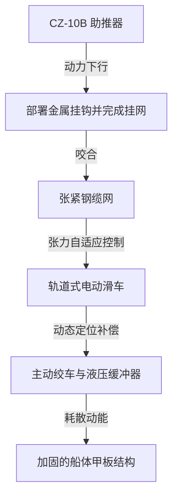

# 空中织网，海上“捞”火箭：长征十号乙海上网系回收的物理豪赌、应力困局与风浪博弈

2026年7月10日，中国运载火箭技术研究院（CALT）完成了许多航天工程师眼中的“地狱级”操作：成功在海上用网系捕捉回收了**长征十号乙（CZ-10B）**运载火箭的一级助推器。这枚760吨级的中型运载火箭从海南商业航天发射场腾空而起，将卫星送入近地轨道（LEO），随后重返大气层。六分钟后，它既没有像SpaceX的猎鹰9号那样展开着陆腿，也没有像星舰那样由陆基发射塔的“筷子”夹住，而是从箭体前部伸出特制金属钩，精准地勾住了悬挂在“领航者”号回收船甲板上的张力网。

这次首飞成功堪称一场巨大的工程豪赌。它将回收的物理载荷与风险从火箭本身转移到了漂浮的海上平台上。然而，在震撼的现场视频背后，隐藏着一套极其复杂的结构、热力学和物流权衡，这在国际航天界引发了广泛的讨论和分歧。

```
                      【起飞与重返大气层防热方案对比】
      
      SpaceX 猎鹰9号                             中国航天 CZ-10B
    ┌───────────────┐                       ┌───────────────┐
    │     过渡段    │                       │     过渡段    │◄─── 回收挂钩
    │               │                       │               │    （承受局部集中载荷）
    │               │                       │               │
    │               │                       │               │
    │               │                       │               │
    │               │                       │               │
    │               │                       │               │
    │               │                       │               │
    │    着陆腿     │◄─── 带来极高气动阻力    │   光洁箭体    │◄─── 无气动与热阻力
    │   （尾部安装）│     及羽流热防护负担    │               │     无需牺牲尾部防热
    └───────────────┘                       └───────────────┘
```

### 捕捉 vs. 着陆：火箭回收的三重架构分水岭
要理解CALT的这一创举，我们需要将其与SpaceX开创的两大主流回收范式进行对比：

1. **SpaceX 猎鹰9号（尾部着陆腿传统）**：猎鹰9号依赖四个碳纤维复合材料着陆腿。这种方案虽已臻成熟，但着陆腿及其液压驱动机构为火箭带来约**2.1吨**的干质量牺牲。这部分“死重”必须被一路带到一二级分离点，直接蚕食了近地轨道的运载能力。此外，着陆腿在重返大气层时，还会暴露在极高的气动阻力和发动机羽流的高温环境中。
2. **SpaceX 星舰（陆基“筷子”夹持）**：超重型助推器通过取消着陆腿，改用发射塔上的巨型机械臂（俗称“筷子”）在空中夹持。助推器通过靠近前部格栅舵的两个承力销挂在机械臂上。通过将“着陆支架”的重量转移到静止的陆基发射塔上，SpaceX最大化了火箭的运载能力并缩短了周转时间，但这要求厘米级的制导精度。
3. **CALT 长征十号乙（海上网系捕捉）**：CZ-10B则将海上回收的下行距离优势（避免了返回发射场所需消耗的大量“返场烧”推进剂）与无腿设计的减重效益融为一体。在减速下降过程中，火箭从前部段部署金属挂钩，勾住悬挂在回收船上的紧绷钢缆网。

### “领航者”号捕获系统的机械奥秘
“领航者”号海上回收平台是一艘长144米、宽50米、排水量达2.5万吨的巨型平顶驳船。为了在开阔洋面上完成这次“空中接力”，该船装备了一套高度主动化的机械阻拦系统：



* **轨道式自动滑车**：紧绷的钢缆网悬挂在一个67米高的桁架结构上。这张网并非静止不动，其主要的张力控制线锚定在可在甲板轨道上滑动的自动滑车上。当火箭降落时，船载激光雷达和雷达实时追踪其轨迹，滑车在轨道上动态滑动，以补偿火箭的横向漂移，使网与火箭精准对齐。
* **动能吸收机制**：当火箭挂钩咬合钢缆网的瞬间，受闭环液压制动器控制的绞车滚筒开始放缆。滑车向内移动收紧网具几何形状，在数米的减速行程中温柔地吸收火箭的巨大动能。这避免了可能拉断钢缆或导致火箭外壳屈曲的突发冲击载荷。
* **DP2级动力定位**：驳船采用DP2级动力定位系统，以应对风浪影响，保持船体航向和相对位置的稳定。

### 结构与热力学的“质能守恒”
通过砍到着陆腿，CALT成功为CZ-10B一级减重了约**1.8至2.2吨**的干质量。得益于这部分载荷的释放，CZ-10B在可重复使用模式下的LEO运载能力达到了**16吨**。

从空气动力学和防热的角度来看，无腿火箭的箭体流线极为完美。传统的着陆腿会在火箭气动外形上产生缝隙，在重返大气层时引发紊流和严重的热量集中。而光洁的圆柱形箭体则允许在火箭尾部采用更轻、更均匀的热防护系统（TPS）。

然而，物理定律是无情的，结构载荷并没有凭空消失，它只是被“乾坤大挪移”了。传统火箭降落时由尾部的推力结构支撑，该结构天然就是为了承受数千吨发动机推力而加强的。而CZ-10B在挂网时则是被“吊”在前部的挂钩上。这直接将减速产生的巨大张力转移到了火箭的前部壳段。为了防止火箭在悬挂时被自身重力拉碎或在捕捉瞬间发生局部屈曲，CALT必须在火箭前段引入厚重的内部加强环和承力纵梁。这在一定程度上又将好不容易省下的重量给“吃”了回去。

### 海上风浪之困：三维扰动与局部集中应力
业内对该方案的最大质疑，在于海洋气象的极度不可预测性。与SpaceX在陆地上纹丝不动的“筷子”不同，“领航者”号在风浪中面临着纵摇、横摇和垂荡等多自由度的复合运动：

> “在陆地上用刚性塔捕捉火箭是一个已解决的数学问题。但在波涛汹涌的公海上用漂浮平台进行捕捉，则引入了三维空间的无序混沌。67米高的回收桁架只要产生微小的2度横摇，塔顶就会产生超过2.3米的横向位移。制导控制算法必须在毫秒级内解算并修正这一偏差。”
> —— **Jean Deville**，*东方向导*（Dongfang Hour）航天分析师

此外，如果火箭在挂网时带有任何横向速度，都会引发不对称的张力。这会在挂钩与箭体连接处产生极端的局部集中应力。一旦挂钩发生弯曲变形或前部壳段产生结构微损伤，后续就需要进行极其繁琐的无损检测（NDT）和结构修复，这势必将大幅拉长火箭的回收翻新周期。

### 煤油结焦的“卡脖子”瓶颈
即便海上的物理捕捉做到天衣无缝，CALT还要面对化学层面的一大难关。CZ-10B一级配备了7台**YF-100K液氧煤油发动机**，而二级则使用以甲烷为燃料的**YF-219发动机**。

航天煤油是重烃类混合物。在重返重力场的极高温度以及发动机关机后的余热作用下，冷却通道中未完全燃烧的煤油会发生**结焦（Coking）**——在管壁沉积碳和碳黑。SpaceX spent a decade refining the metallurgy and cleaning protocols to reuse its RP-1 Merlin engines. 对于CALT而言，要想在2026年底的可重复使用演示飞行中实现**30天周转周期**的目标，必须在短时间内建立起一套高效、彻底的发动机内部冲洗洗涤工艺。

3. 社盟推广摘要（Highlight）
3.1 核心问题
1. 相比SpaceX的着陆腿和陆基机械臂夹持，长征十号乙的海上网捕回收在技术路径上有何本质不同？
2. 在波涛汹涌的海面上，回收船如何精准捕捉并温柔地卸掉几十吨重下坠火箭的巨大动能？
3. 航天煤油结焦难题将如何影响长征十号乙火箭的回收周转效率与商业化进程？

3.2 摘要正文
火箭回收迎来第三条道路！2026年7月10日，长征十号乙成功实施海上网捕回收，引发航天界激烈论战。支持者认为，取消近2吨重的着陆腿让火箭重返大气层时气动阻力骤减，可重复使用模式下LEO运载力飙升至16吨；质疑者则指出，海况的不可预测性是致命痛点，67米高的回收架仅2度横摇就会带来2.3米偏移，极易造成火箭前壳段局部应力过载变形。此外，YF-100K发动机重烃煤油结焦引发的清理难题，也将直接考验CALT宣称的30天周转极限。

3.3 关键词标签
#长征十号乙 #火箭回收 #商业航天
