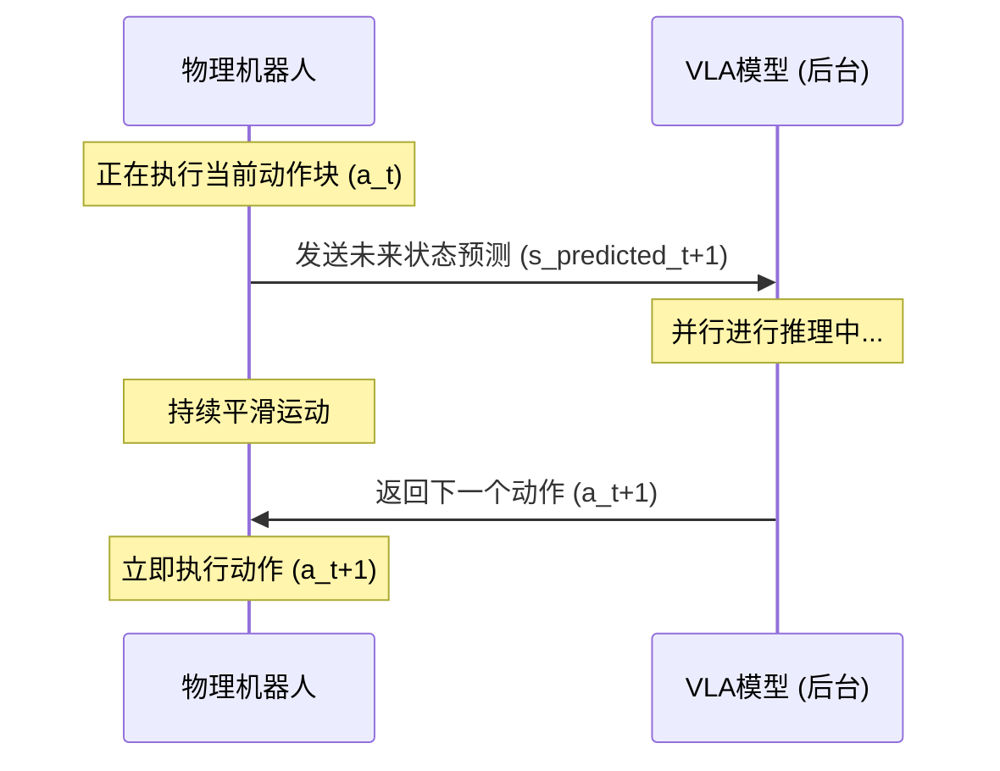

# 终结“卡顿机器人”：MIT推出VLASH框架，如何攻克具身智能的致命时延痛点？

在构建通用物理世界具身智能（Physical AI）的军备竞赛中，整个行业正撞上一堵高墙——而这堵墙与数据规模或参数大小毫无关系。它是机器人的“隐形杀手”：**推理延迟**。

虽然像 OpenVLA 或 Physical Intelligence 的 $\pi_0$ 等大型视觉-语言-动作（VLA）模型展现了惊人的语义推理能力，但在物理世界部署它们却让人抓狂。在标准部署中，机器人饱受控制工程师所称的“结巴机器人”（stuttering robot）问题的折磨。由于传统的 VLA 推理是同步进行的，机器人必须先捕获图像，暂停物理运动，等待 100 到 500 毫秒让模型去“思考”（计算推理），然后执行生成的动作块（action chunk），接着再次停下来重复这一循环。这导致机器人的动作断断续续、延迟极高，在面对真实的动态任务时几乎毫无用处。

为了攻克这一难题，麻省理工学院（MIT）韩松（Song Han）副教授和博士生唐家明（Jiaming Tang）领衔的团队，联合清华大学、英伟达、加州大学伯克利分校、加州大学圣地亚哥分校和加州理工学院的研究人员，共同推出了 **VLASH**（视觉-语言-动作异步推理框架）。该成果发表于最新论文《*VLASH: Real-Time VLAs via Future-State-Aware Asynchronous Inference*》（arXiv:2512.01031）中。该框架在无需重新训练底层 VLA 模型，也无需修改其架构的前提下，将机器人的**反应延迟降低了高达 17.4 倍**，并实现了 **2.03 到 3 倍的任务完成速度提升**。

---

### 架构设计：攻克“时间错位”难题

要实现机器人的异步运行，绝非简单地将输入导向后台进程那么简单。如果机器人在时刻 $t$ 执行动作的同时向 VLA 发起查询，VLA 会基于当时的状态 $s_t$ 返回动作指令 $a_{t+1}$。然而，当 VLA 完成推理计算时（时刻为 $t + \Delta t_{\text{inference}}$），物理机器人早已运动到了另一个位置 $s_{t+\Delta t}$。这种偏差被称为**时间错位**（temporal misalignment）。如果机器人强行在状态 $s_{t+\Delta t}$ 下执行针对旧状态 $s_t$ 计算出的动作 $a_{t+1}$，就会导致动作过冲、碰撞或偏离目标。

VLASH 的核心解法是引入**未来状态感知异步推理**（Future-State-Aware Asynchronous Inference）循环。VLASH 不再向 VLA 传送当前已过时的状态 $s_t$，而是利用机器人的主动控制轨迹对状态进行“前推”。它能够在数学上精确预测出在 VLA 推理完成的瞬间，物理机器人所处的未来状态 $s_{t+\text{latency}}$：

$$s_{t+\text{latency}} = f(s_t, a_{t:\text{latency}})$$

其中：
- $s_t$ 是当前测量状态（包括关节角度、末端执行器位姿以及相机图像输入）。
- $a_{t:\text{latency}}$ 是机器人控制器当前正在执行的动作轨迹。
- $f$ 代表正向运动学和环境转换预测器。

通过将这一预测出的未来状态 $s_{t+\text{latency}}$ 输入 VLA，模型计算出的下一个动作块 $a_{t+1}$ 就能与机器人届时的未来物理位姿完美对齐。这使得 VLA 推理能与机器人的物理执行完全并行，彻底消除了每次动作间的停顿。

---

### 动作量化：在控制粒度中寻找“甜点区”

在边缘硬件上，让基于大语言模型的设计器去直接运行高频控制循环（如 100Hz 至 1kHz）在计算上是不现实的。通常，VLA 模型的输出是动作块（包含 4 到 8 步的动作序列）。VLASH 通过**动作量化**（Action Quantization）优化了这一流程。

通过将细粒度、高频的动作组合成符合轨迹一致性的粗粒度“宏动作”（macro-actions），VLASH 降低了调用 VLA 的频率。这种量化方法在保持控制权的同时，大幅减轻了边缘 GPU（如 Nvidia Jetson Orin 或本地工作站）的计算开销。底层控制器随后对这些量化输出进行插值，从而确保物理机器人在力和速度曲线上保持平滑与连续。

---

### 行业反响：“时延是具身智能的无声杀手”

MIT 韩松实验室这一成果的发布，在机器人学界引发了热烈讨论。在社交媒体 X 和 Reddit 上，专家们针对异步控制的利弊展开了深度交锋。

英伟达（Nvidia）高级研究科学家、GEAR 实验室负责人 **Jim Fan 博士**对此评价道：
> “这是通用物理 AI 迈出的大一步。在机器人领域，延迟是无声的杀手。你不可能在一个同步运行 100 亿参数 VLA 模型的机器人身上，期待它去打乒乓球或接住飞来的物体。VLASH 的未来状态预测，恰恰解决了在不将模型裁剪到‘脑损伤’的前提下，如何连接庞大且缓慢的模型与快速物理动态之间的鸿沟。”

人形机器人公司 Figure 的创始人兼 CEO **Brett Adcock** 同样指出：
> “对于要在动态人类环境中工作的人形机器人来说，连续运动是不可妥协的底线。同步调用造成的卡顿不仅意味着慢，更是物理上危险的，因为这会破坏机器人的惯性和平衡。由像 VLASH 这样的预测性状态估计驱动的异步控制循环，将成为商业人形机器人控制栈的标配。”

不过，Reddit 上 `r/robotics` 板块的一些控制理论学者仍持谨慎态度：
> “在轨迹可预测且环境静止的情况下，状态前推运行得非常完美。但如果发生突然的物理碰撞或接触呢？如果在推理窗口期内，环境状态发生了不可预测的突变，预测出的未来状态就会出错，机器人就会去执行一个针对‘不存在的现实’所设计的动作。系统必须具备备用的反应式控制器（reactive controller）才行。”

---

### 实验结果：从折衣服到快速乒乓球

VLASH 团队公布的实验数据证明，其异步流水线方案在各种物理基准测试中展现出了显著的现实效能：

| 基准任务 | 同步 VLA (基线) | VLASH (异步 VLA) | 性能提升 |
| :--- | :--- | :--- | :--- |
| **折叠衣物** | 抓取动作断续，伴随停顿 | 交付动作平滑、连续 | **3.0倍速度提升** |
| **物体拣选 (Pick-and-Place)** | 0.8 Hz 动作循环 | 2.1 Hz 动作循环 | **2.03倍速度提升** |
| **反应延迟 (Reaction Latency)** | 平均停顿约 280 毫秒 | 平均延迟约 16 毫秒 | **延迟降低 17.4 倍** |
| **动态敏捷性** | 失败（无法追踪） | 玩打地鼠 / 打乒乓球 | **成功解锁高速运动** |

该框架具有硬件无关性，这意味着它可以直接部署在标准工业机械臂（如 Universal Robots UR5）、人形机器人灵巧手和移动操作机器人上。它提供了一种纯软件层面的升级，解锁了现有物理硬件的高速动态作业能力。
