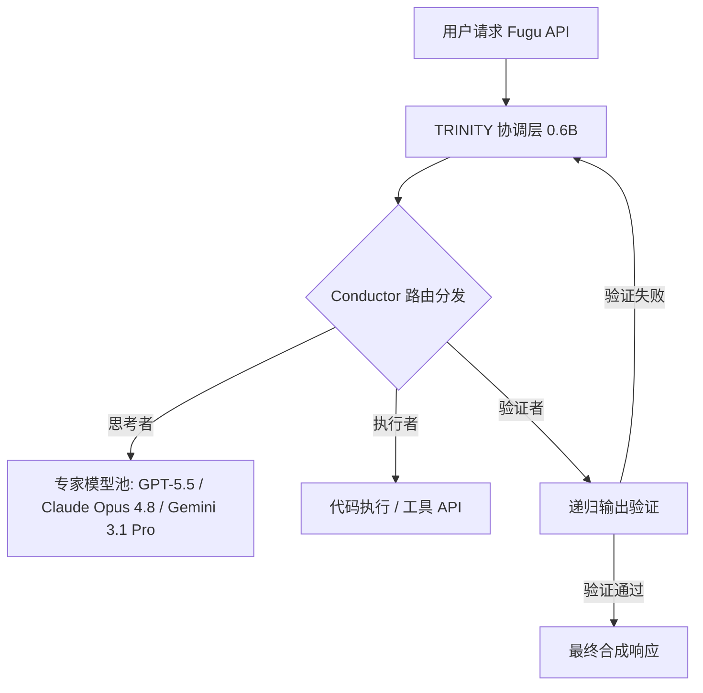

# 群蚁套利：拆解 Sakana AI 对抗单体大模型的“多智能体起义”

2026年6月，硅谷延续了三年的“暴力美学”大模型共识正发生结构性震颤。在过去三年里，行业玩家的打法极其简单粗暴：堆叠更多算力（FLOPs）、扩大参数规模，并训练出日益庞大的单体 Transformer 结构。然而，地缘政治限制与架构瓶颈的双重重击，彻底粉碎了这一既定轨迹。2026年6月12日，美国商务部进一步收紧出口管制，限制非美地区获取 Anthropic 的 Fable 5 和 Mythos Preview 等前沿单体模型。

仅仅十天后的6月22日，总部位于东京的 Sakana AI 便针锋相对地推出了 **Sakana Fugu**（以及专为高难度推理打造的 **Fugu Ultra**）——这是一个由 API 驱动的多智能体协同与路由平台。结合其在6月15日推出的自主式 B2B 战略研究智能体 **Sakana Marlin**（被称为虚拟首席战略官“Virtual CSO”），Sakana 正在将公司的未来全部押注在源自大自然的“群蚁智慧”（Swarm Intelligence）之上。

但这同时抛出了一个核心拷问：由中小型模型协同组成的“群蚁”，真的能取代前沿单体巨兽的通用智能吗？还是说，高昂的 API 延迟、Token 冗余和协同复杂度，会让群蚁架构在商业落地上沦为空中楼阁？

### 协调者的架构：TRINITY 与强化学习
与传统的基础大模型不同，Sakana Fugu 并非以单一巨型神经网络的形式存在。相反，它是一个通过单一、兼容 OpenAI 接口的 API 端点交付的“学习型协调层”。在底层，Fugu 的核心技术源于 Sakana 研究人员在 ICLR 2026 上发表的两篇开创性论文：**TRINITY** 与 **Conductor**。

1. **TRINITY：** 一个仅约 6 亿参数（0.6B）的轻量级协调模型，充当群蚁系统的“交通指挥官”。它能动态分类输入的 Prompt，并将“思考者”（Thinker）、“执行者”（Worker）和“验证者”（Verifier）等专业化角色动态分配给智能体池中的各个小模型。
2. **Conductor：** 一个通过强化学习（RL）训练的模型，其核心任务是自主寻找自然语言的协同策略。Conductor 并没有采用死板的、硬编码的执行图，而是根据问题本身的复杂度，在运行时动态学会如何构建靶向 Prompt、分发路由任务以及处理递归自调用。



正如 Sakana AI 的 CTO **Llion Jones** 在 X 平台上所言：
> “Attention（注意力机制）解决了上下文的扩展问题；而现在，新的瓶颈变成了如何扩展协同能力（Coordination）。Conductor 和 TRINITY 证明了，通过动态重构通信拓扑，一个 0.6B 的协调模型可以从一组更小、更便宜的模型中，榨取前沿级别的推理表现。”

### Marlin：推理期算力的极限探索与 AB-MCTS
如果说 Fugu 协调的是实时的 API 调用，那么 Sakana Marlin 则代表了“推理期算力”（Inference-Time Compute）的极限延伸。Marlin 专为长周期的 B2B 深度战略规划而设计，扮演着“虚拟首席战略官”的角色。用户只需输入一个高维度的研究主题，Marlin 就能自主运行长达 **8小时** 的闭环研究，并最终产出一份包含 60 到 100 页的深度行业战略报告以及配套的演讲幻灯片。

Marlin 的引擎核心依托于**自适应分支蒙特卡洛树搜索（AB-MCTS）**，并结合了源自 Sakana 早前“AI Scientist”项目的自动化工作流。Marlin 并不满足于单一的线性思维链（CoT），而是将推理视作一棵博弈树。它会并发评估多个潜在假说，剪掉走不通的逻辑分叉，并在后台将子问题动态委托给最合适的专用模型进行逐一攻克。

```
Marlin 决策树 (AB-MCTS)
         [初始研究目标]
               /         \
          [假说 A]      [假说 B]
           /     \             |
        [通过]  [剪枝]     [验证循环]
                           /         \
                      [汇报PPT]  [100页报告草稿]
```

AI 领域的先驱 **吴恩达（Andrew Ng）** 对此指出：
> “Marlin 和 Fugu Ultra 是极其具象的证据，证明了智能体工作流和多智能体协同是通往最顶尖性能的最快路径。我们正在目睹整个 AI 算力的重置：算力正在果断地从训练期的预训练，向推理期的执行转移。”

### 基准测试对决：Fugu Ultra 闪击 SWE-bench Pro
为了向市场证明“群蚁架构”的生存能力，Sakana AI 在硬核编码基准测试 **SWE-bench Pro** 上对 Fugu Ultra 进行了大考。根据官方公布的数据，Fugu Ultra 取得了 **73.7%** 的高分，击败了诸多独立运行的旗舰单体模型：

*   **Fugu Ultra (群蚁协调器)：** 73.7%
*   **Claude Opus 4.8 (单体大模型)：** 69.2%
*   **GPT-5.5 (单体大模型)：** 58.6%
*   **Gemini 3.1 Pro (单体大模型)：** 54.2%

尽管如此，Fugu Ultra 距离 Anthropic 依然处于受限状态的旗舰模型 **Fable 5**（成绩为 80.0%）仍有差距。

不少学术界领袖也表达了谨慎态度。Meta 首席 AI 科学家 **Yann LeCun** 评论道：
> “将多个自回归 LLM 简单拼凑成一个‘蚁群’，并不能解决它们底层缺乏世界模型（World Model）的硬伤。你最终得到的只是一个‘幻觉委员会’，让一群胡说八道的智能体互相纠正彼此的胡言乱语。但话又说回来，对于像 SWE-bench 这种具有确定性结果的编码任务，这种迭代验证循环确实管用。”

### 蚁群的商业账本：Token 暴涨与高延迟
群蚁架构的核心战场最终仍在经济层面。Fugu Ultra 的定价为**每 100 万输入 Token 收费 5.00 美元**，**每 100 万输出 Token 收费 30.00 美元**，而命中缓存的输入 Token 价格则低至 **0.50 到 1.00 美元**。

为了吸引开发者，Sakana 推出了**“不叠加收费”（no stacked fees）**政策：用户只需支付请求中处于最顶尖模型的那部分费率，而无需为每一个中间调用的子智能体重复付费。

然而，蚕食利润的隐形杀手在于 **Token 暴涨（Token Bloat）**。由于 Fugu 底层的 TRINITY 和 Conductor 模型需要递归调用验证器、重写 Prompt 并进行推理分支搜索，一次普通的查询在后台可能瞬间产生数百万个用于系统协调的中间 Token。

著名风险投资人 **Brad Gerstner** 直言不讳地指出：
> “多智能体系统在企业级应用中的利润空间极其严峻。如果 Fugu Ultra 因为存在大量的递归验证，导致其消耗的 Token 体量达到单次 GPT-5.5 调用的 5 到 10 倍，那么高昂的 API 成本将彻底吞噬开发者的利润空间。‘不叠加收费’政策虽有缓释，但 Token 暴涨依然是利润率的无声杀手。”

此外，Fugu Ultra 还带来了难以妥协的延迟。尽管 Fugu 的标准版针对低延迟交互任务进行了优化，但 Fugu Ultra 的运行速度依然极其缓慢，这使得它几乎无法应用于任何对实时性有高要求的场景。

### 地缘政治的“群蚁套利”
在 Sakana AI 2026年6月的发布中，最引人遐想的或许是其地缘政治定位。通过采用可插拔、可替换的模型池架构，Fugu 在设计之初就被赋予了对冲单一供应商绑定（Vendor Lock-in）和美国出口管制的使命。

对于东亚或欧洲的企业而言（尽管 Fugu 目前因 GDPR 合规问题暂时在欧盟和欧洲经济区受阻），Fugu 描绘了一种极为可行的地缘套利范式。当一个国家被切断与 Anthropic Fable 5 或 OpenAI 顶尖单体模型的连接时，企业可以通过 Fugu 动态编排一组不受限制的、小参数的开源模型（如 Llama 或 Mistral 的衍生版本），以重新拼凑出抗衡顶级单体模型的推理能力。

正如 Sakana AI 首席执行官 **David Ha** 所总结的：
> “自然界从不靠制造一个庞大臃肿的大脑来统治海洋，而是通过协调一整群鱼。Fugu 是我们迈向可进化、可替代 API 的第一步，它将让单体大模型的绑定霸权成为历史。”

这种“群蚁”路径究竟只是非美国家规避出口管制的过渡性手段，还是软件工程的终极未来？这已成为 2026 年下半年科技界最具张力的终极博弈。
