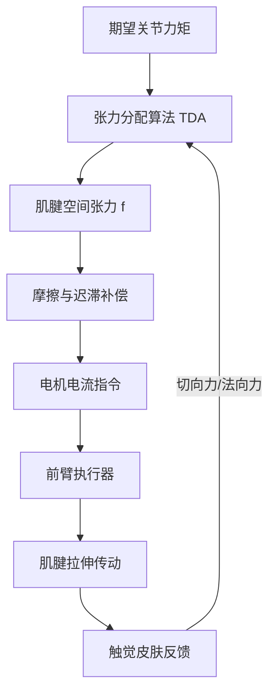

# 腱驱的豪赌：拆解 1X 25自由度“力透明”灵巧手与人形机器人终极战役

在将通用人形机器人推向千家万户的竞赛中，决定胜负的终极战场不是行走或平衡，而是那双“手”。当双足步态控制逐渐收敛于准直驱（QDD）执行器与强化学习（RL）的结合方案时，上肢的灵巧操作（Manipulation）依然是一片群雄逐鹿的蛮荒之地。近期，1X Technologies 发布了为其 NEO 人形机器人打造的 25 自由度（DoF）灵巧手，再度引爆了机器人学界的热烈争论：基于腱驱（Tendon-driven）的柔顺性路线能否在家庭场景胜出？还是说，复杂的线束阵列在量产阶段会成为无法逾越的工程灾难？

### 1X 腱驱技术的解剖学构造
传统的机器人灵巧手（如 Figure 02 配备的 16 自由度末端执行器）通常采用将刚性电机和减速箱直接嵌入手指内部的方案。而 1X Technologies 则走向了完全相反的方向。NEO 灵巧手在手掌和手指中塞入了多达 22 个完全主动驱动的自由度，再结合一个 3 自由度的手腕，整只手共拥有 25 个自由度。

为了在不让灵巧手变得臃肿笨重的前提下实现如此高的自由度密度，1X 将高强度聚合物肌腱（通常是类似于 Dyneema 的超高分子量聚乙烯 UHMWPE 材质）从前臂的执行器出发，穿过腕关节路由至手指。这种设计高度模仿了人类从前臂到手部的肌肉骨骼系统，使灵巧手能够保持轻量、纤细，且运行噪声极低（仅约 22 分贝，低至耳语水平）。

### “力透明”背后的物理学
NEO 灵巧手的核心杀手锏在于“力透明（Force Transparency）”。在传统工业机器人中，关节通常使用极高减速比（例如 100:1 或 200:1 的谐波减速器）来最大化输出扭矩。然而，高减速比变速箱会引入巨大的反射惯量（反射惯量 $J_{\text{reflected}} = G^2 \cdot J_{\text{motor}}$，其中 $G$ 为减速比）以及非线性摩擦，从而屏蔽掉外界作用力。为了感知捏握力度，机器人不得不依赖昂贵的关节力矩传感器或触觉皮肤。

1X 另辟蹊径，采用了极低的减速比（在 5:1 到 15:1 之间）。电机电流（$I$）与关节力矩（$\tau$）的关系可以用以下公式表示：
$$\tau = K_t \cdot I \cdot G \cdot \eta$$
其中 $K_t$ 为电机力矩常数，$G$ 为减速比，$\eta$ 为传动效率。

由于 $G$ 极低，且肌腱传动具有极高的反向驱动性，系统的反射摩擦力几乎可以忽略不计。执行器此时化身为双向换能器：它们既能施加精准的力，又能实时“感知”阻力。当灵巧手碰撞到桌面时，反作用力会直接穿过线束回传至前臂的电机，控制回路能据此做出毫秒级的瞬时响应。

### 控制的梦魇：迟滞与张力控制
虽然力透明在机械设计上堪称完美，但要控制一个 25 自由度的腱驱网络，对软件工程师而言无异于一场噩梦。腱驱系统面临三个核心痛点：
1. **单向驱动特性**：线缆只能拉，不能推。为了实现单个关节的双向运动，必须使用类似人类肱二头肌与肱三头肌的拮抗肌腱对（Antagonistic Pair），或者设计弹簧复位机构。
2. **关节耦合**：将 22 根肌腱线束穿过一个 3 自由度的手腕，意味着手腕的弯曲会直接改变手指肌腱的路径长度，进而导致张力发生漂移。
3. **线缆拉伸与迟滞**：即便是超高模量的聚合物线缆，在长期使用中也会发生弹性形变与蠕变。

为了防止肌腱脱轨或松弛，1X 引入了张力分配算法（Tension Distribution Algorithm, TDA）。TDA 通过结构矩阵 $W^T(\theta)$ 将期望的关节空间力矩（$\tau$）映射到肌腱张力空间（$f$）：
$$\tau = W^T(\theta) f$$
且必须满足约束条件：
$$f_{\text{min}} \le f \le f_{\text{max}}$$
其中 $f_{\text{min}} > 0$ 用于确保线缆永远不会松弛。

此外，为了克服腱鞘内部的摩擦力和迟滞效应，控制工程师必须引入 **LuGre 摩擦模型** 进行前馈补偿，并使用 **Bouc-Wen 模型** 来预测快速加载循环中的迟滞行为。

### 触觉感知层与 IP68 级别防护
与低减速比执行器相得益彰的，是包裹在手指上的多模态触觉感知皮肤。NEO 的指尖并非依赖简单的二值接触开关，而是能测量法向力、接触位置以及切向力（剪切力）。切向力的检测是手内精细操作的“圣杯”：它允许控制系统检测到“滑移先兆（Incipient Slip）”——即物体掉落前瞬间产生的微弱振动，从而动态调整握力防止掉落。

对于家用场景来说，整只手达到 IP68 级密封并包裹着可清洗、食品级的聚合物“外皮”至关重要。1X 首席执行官 Bernt Børnich 多次强调，可水洗是家用机器人的硬性指标。“如果一个机器人不能洗碗、不能抓取生鸡肉，并且不能在水龙头下直接冲洗而不短路，那它根本不配进入厨房，”Børnich 说道。

### 人形机器人的大辩论：腱驱 VS 刚性 QDD VS 液压
目前，机器人行业在灵巧手的技术路线上呈现三足鼎立之势：
*   **特斯拉 Optimus (Gen 3)**：特斯拉也转向了 22 自由度灵巧手，同样采用从前臂路由线缆的设计。与 1X 一样，特斯拉赌的是“前臂-腱驱”布局能最小化手指惯量，但其设计更加聚焦于汽车制造组装以及极致的量产规模优化。
*   **Figure 02**：Brett Adcock 的团队则选择在手指内部直接嵌入 QDD 电机的 16 自由度方案。该路线的支持者认为，这彻底消除了复杂的肌腱走线梦魇，避免了线缆磨损，并极大地简化了标定流程。
*   **Sanctuary AI (Phoenix)**：Geordie Rose 团队此前一直偏爱液压驱动。液压方案拥有无可比拟的功率密度与响应速度，但批评者指出，在家庭环境中存在漏液风险，且布置加压液压管路的复杂度极高。

在社交媒体和 Reddit 的 `r/robotics` 板块上，硬件工程师们对 1X 腱驱系统的可靠性表达了深切质疑。一条高赞评论写道：“将 25 根肌腱穿过一个活动腕关节，简直是一个随时会爆炸的维护炸弹。只要有一根聚合物线缆断裂或拉伸超出标定极限，整只手就会瞬间瘫痪。”

对此，1X 前 AI 副总裁 Eric Jang 指出，硬件的物理复杂度可以通过 1X 的“数据引擎”方法来弥补。通过人类遥操作收集海量数据，AI 能够直接从数据中学习如何控制这只柔顺的灵巧手，从而绕过了对完美解析运动学模型的依赖。

### 量产与市场展望
目前，1X 正在其位于加州海沃德和挪威的工厂自主制造这批灵巧手。然而，从手工装配的科研样机跨越到量产数千台通过 IP68 认证的腱驱人形机器人，这中间有着巨大的制造鸿沟。如果 1X 能够证明其超高分子量聚乙烯肌腱在经历数百万次循环后仍不断裂，他们将为人形机器人安全进入家庭奠定行业标杆。否则，他们可能不得不妥协，退回到结构更简单、更刚性的行星减速器方案。
