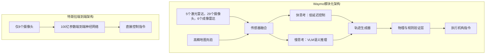

# **自动驾驶的“伪山顶”：Waymo模块化冗余与特斯拉端到端黑盒的终极对决**

2026年8月26日，Waymo车载软件副总裁Srikanth Thirumalai发表了一篇技术宣言：[《从2亿多英里完全自动驾驶中汲取的10条AI教训》](https://waymo.com)。这一宣言的发布时机绝非巧合。它刻意选在特斯拉9月3日“Cybercab”无人驾驶出租车（Robotaxi）发布会的前夕。Thirumalai用极具技术说服力的论证，直接给特斯拉宣称能通往无监督驾驶的“纯视觉端到端神经网络”路线划出了一道不可逾越的红线。

这场自动驾驶哲学分野的核心，折射在Waymo的第十条教训中：**没有任何东西可以替代真正的完全自动驾驶里程。** Thirumalai尖锐地指出，试图将有监督的L2级辅助驾驶系统（如特斯拉的FSD）演进为L4级完全自动驾驶，不过是一场“伪山顶”（False Summit）的徒劳攀登。在有监督的模式下，AI被隔离在其决策的真实物理后果之外。人类安全员的存在过滤了绝大多数极端路况（edge cases）、纠正了险些发生的事故，并接管了分布外（OOD）场景。这种持续的“人类安全网”不仅污染了训练集的数据分布，更让神经网络失去了从自身错误的真实后果中学习的机会。

这与埃隆·马斯克的愿景背道而驰。特斯拉的战略完全建立在利用海量车主有监督驾驶数据，来训练一个“像素输入、扭矩输出”的单一端到端神经网络上。但在Cybercab即将发布之际，特斯拉近期频发的安全失效事件再次引来监管风暴。最令人瞩目的是2026年8月的一起事故：一辆运行FSD v14.3.7的特斯拉未能识别正在闪烁的铁路道口警示灯，逼得驾驶员紧急踩下刹车才险些避免与火车相撞。这不仅让美国监管机构重新展开调查，更将“端到端黑盒”方案的底层脆弱性彻底暴露在聚光灯下。

### 架构分野：模块化“快慢思考”与端到端策略网络的宿命之争

两家系统的核心技术争论，聚焦于系统如何感知、处理并对现实世界做出决策。

#### Waymo的模块化冗余路线
Waymo的第五代自动驾驶系统（Waymo Driver）配备了极其奢华的传感器阵列：5个激光雷达（提供360度高密度点云）、29个摄像头（视角重叠）以及6个毫米波成像雷达。这套感知栈与高精地图（HD Map）“先验”紧密融合。Waymo并未将高精地图作为刻板的行驶轨道，而是作为路网结构、限速、人行道等静态几何的“记忆缓存”。这让车载计算平台能把宝贵的算力预算倾斜给动态障碍物的处理，而不是在行驶中实时重建静态世界。

在系统架构上，Waymo采用了类似于人类认知的大脑“快慢思考”框架：
*   **“快思考”（Thinking Fast）**：运行低延迟、极致优化的神经网络处理传感器数据，实时输出即时行驶轨迹。
*   **“慢思考”（Thinking Slow）**：由并行的多模态视觉语言大模型（VLM）运行，进行高阶语义推理（如识别交警手势、理解复杂的施工路段布局等）。
*   **物理验证层**：最关键的是，Waymo彻底拒绝了“黑盒”逻辑。神经网络规划器提出的行车轨迹，必须通过车载运行的独立物理验证层进行二次过滤。这个验证层是一个基于经典物理学和交通规则的硬性防火墙，实时比对碰撞包络线、摩擦极限以及交通法规。一旦AI规划出危险变道或制动失败，该层将瞬时强行干预并修正指令。

#### 特斯拉的端端“Software 2.0”
相比之下，特斯拉的FSD v12以及即将推出的v15则彻底颠覆了模块化流水线。此前，特斯拉还保留了分立的感知网络（输出3D矢量空间和占用网格）与包含数十万行启发式规则代码的C++规划器。而到了全新的端到端范式下，一个超大规模的深度神经网络直接吞入8个摄像头的原始图像像素，并直接输出转向、制动和加速等底盘控制指令。

马斯克的核心哲学是，人类驾驶员仅依靠双眼（被动光学传感器）和大脑（神经网络）进行导航。因此，像激光雷达这样的主动传感器不仅是冗余的，还会因数据冲突增加系统混乱。

然而，缺乏独立的物理校验层已成为特斯拉难以弥补的死穴。在FSD v14.3.7道口险些撞火车的事故中，失败的并不是某行C++代码，而是因为端到端网络的行车策略根本没有输出制动指令。面对强光直射、特殊的轨道结构和闪烁警示灯交织的分布外（OOD）极端路况，神经网络的参数空间未能给出正确解。由于没有模块化的硬性规则（如“若铁路道口红灯闪烁，车速必须归零”）进行兜底，这个完全由数据驱动的“黑盒”就这么直直地开了过去。

### 算力与内存瓶颈：HW4与Cybercab的技术代差

限制特斯拉的另一个重大技术障碍在于车载硬件。目前主流车型配备的Hardware 4（HW4/AI4）平台内存（RAM）空间严重受限，且必须与智能座舱系统共享。原生运行特斯拉全新的百亿参数量级神经网络，对HW4的硬件资源是毁灭性的榨取。

为了在现有消费级车辆上部署，特斯拉不得不对模型进行高强度的“参数蒸馏”（Weight Distillation），即部署被阉割的“FSD Lite”版本。这种压缩极大地削弱了模型处理长尾长尾边缘场景的能力，这也完美解释了为什么特斯拉内部测试表现惊艳，而普通用户在现实中的体验却大打折扣。

行业供应链消息显示，即将于2026年9月3日发布的Cybercab将通过硬件升级打破这一枷锁：它将配备内存翻倍的全新计算板，甚至直接搭载AI5芯片。这使得Cybercab能够以原生状态运行未经蒸馏的完整版FSD v15。然而，这无疑给特斯拉带来了巨大的商业与公信力冲突——此前为“全自动驾驶”买单的百万HW4车主可能会发现，自己车上的硬件在数学极限上根本无法承载真正的无监督全自动驾驶软件。

### 业界论战：AI巨擘的技术思辨

这场争论让硅谷的AI学界与产业界彻底分化。

前特斯拉AI总监、推动特斯拉转向“软件2.0”的奠基人**Andrej Karpathy**对端到端学习依然保持乐观，但也承认了验证阶段的挑战：
> “向端到端神经网络的过渡是一场巨大的范式转变。它用优化算法取代了传统代码。但对这些网络的评估已经成为绝对的瓶颈——你需要庞大的模拟闭环和自动评估机制，来揪出神经网络行为异常的每一个瞬间。”

相反，Meta首席AI科学家**Yann LeCun**对特斯拉的营销话术以及纯自回归端到端模型在安全关键任务中的局限性提出了尖锐批评：
> “无监督驾驶需要能够预测物理环境变化的‘世界模型’。而现有的端到端架构缺乏能够确保安全的推理和规划层。你不可能仅仅通过在人类驾驶视频上训练一个黑盒，就奢望它永远不会在有火车经过的铁路口幻觉出一条‘康庄大道’。”

Cruise前CEO **Kyle Vogt**则反复为传感器冗余辩护：
> “激光雷达不是拐杖，而是物理世界的真实地基。只依赖摄像头，意味着你试图从2D投影中去重建3D空间。这在数学上是不适定问题（ill-posed problem），在遭遇大雾、沙尘或强光直射等极端场景时，注定会发生灾难性的失效。”

自动驾驶资深分析师**Brad Templeton**则总结了双方在规模化路径上的博弈：
> “Waymo爬的是一座极其险峭且昂贵的大山，但它已经通过地理围栏和冗余硬件在特定城市登顶。特斯拉走的是一条坡度较缓的斜坡，能瞬间在全球铺开，但在无监督安全验证的垂直峭壁前，如果没有物理传感器或高精地图，他们可能会发现自己根本无路可通。”

### 商业模式：两种规模化路线的博弈

两家公司的商业化策略，是其技术架构的直接映射。

*   **Waymo的“重资产”无人出租车模式**：由于激光雷达等硬件成本（单车估计数万美元）和高精地图的持续采集维护，其单车经济学成本居高不下。但Waymo已成功实现商业变现，在旧金山、凤凰城、洛杉矶和奥斯汀每周提供数万次完全无人的载客出行。其扩张路径是克制、安全且重资本驱动的。
*   **特斯拉的“轻资产”消费车队模式**：特斯拉部署FSD的边际成本几乎为零，因为感知硬件已预装在每一辆售出的新车中，这让特斯拉能低成本获取数十亿英里的车主训练数据。但Cybercab的商业神话完全取决于监管机构对“无监督驾驶”的审批。如果因闪烁道口这类致命事故，监管机构拒绝批准无高精地图、纯视觉的方案，特斯拉庞大的AI算力投资将依然只能委身于有监督的L2级辅助驾驶框架内。
