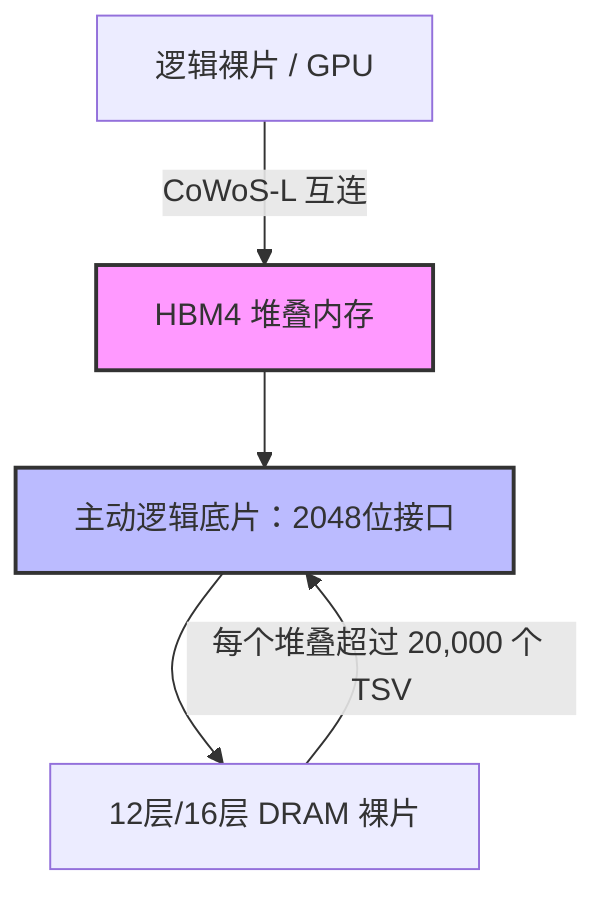

# 英伟达的“垂直夹击”：Blackwell-Rubin 15%溢价内幕、70亿美元Poolside软件豪赌与AI工厂的物理电网困局

#### 内存挤压：为何HBM成为系统15%溢价的幕后推手
在芯片底层，先进封装的物理极限正在与各大巨头的资本支出预算发生正面碰撞。英伟达近期已向其超大规模云服务商（Hyperscalers）和新型云服务商（Neoclouds）客户发出通知，计划对定于2027年初推出的Grace Blackwell NVL72以及下一代Vera Rubin平台提价15%以上。

历史上，逻辑芯片在AI加速器的物料清单（BOM）中占据绝对主导地位，GPU曾占系统总成本的80%以上。然而，根据半导体研究机构SemiAnalysis的追踪数据，高带宽内存（HBM）和高密度服务器DRAM目前已占现代AI服务器总制造成本的30%至73%。随着HBM3e的合约价格在17美元/GB附近徘徊，内存已成为硬件总成本飙升的核心推手。

从HBM3e向HBM4的硬件过渡进一步加剧了这种成本压力。HBM4引入了革命性的架构变革：接口宽度翻倍至2048位，并首次引入主动逻辑基底裸片（Active Logic Base Die）来替代被动硅中介层。这一架构要求采用台积电最先进的CoWoS-L封装，并将每个堆叠的硅通孔（TSV）密度推高至20,000个以上。



这种极高的封装复杂度将行业议价权重新送回了存储三巨头手中：
*   **SK海力士：**凭借独家的批量回流模制底部填充（MR-MUF）工艺主导市场，预计将斩获英伟达下一代Rubin平台约70%的市场份额。
*   **三星：**在逐步解决HBM3e的良率瓶颈后，三星正通过其垂直整合的“zHBM”方案力争在HBM4上实现80%的良率。该方案通过将内存直接堆叠在逻辑裸片上，从而彻底绕过中介层。
*   **美光：**虽然持续扩大HBM4产能，但由于其2026年的产能已被预订一空，市场供给依旧极度吃紧。

正如Atreides Management创始合伙人Gavin Baker在X上指出的那样：“内存历史上是一种强周期性的大宗商品，但在AI时代，HBM已转变为一种高定制化的系统级组件。SK海力士和美光拥有的定价权，将成为GPU毛利率的结构性阻力。”为了对冲不断攀升的内存成本，英伟达选择将这笔15%的溢价直接转嫁给客户，这意味着每部署一吉瓦（GW）的数据中心容量，客户将需要额外承担约500万美元的资本支出（Capex）。

---

#### 基础设施瓶颈：Cloverleaf与算力的物理极限
即使超大型云服务商能够消化这15%的硬件溢价，他们也面临着一个更根本的制约：电力输送与散热管理的物理定律。为此，英伟达对电网基础设施公司Cloverleaf Infrastructure进行了战略股权投资。该公司由CEO David Berry、首席商业官Brian Janous（前微软能源负责人）及CTO Jonathan Abebe共同创立。

Cloverleaf扮演着“能源中介”的角色，利用英伟达的DSX数字孪生平台对电网容量、冷却负荷以及水资源消耗进行多维建模，完成科学论证后再动工建设。这主要是为了解决当前两大核心物理瓶颈：

##### 1. 电网并网申请与关键设备排期
在美国各大区域输电网络（如PJM、ERCOT、MISO和CAISO）中，积压的并网申请规模已累计超过2300 GW。开发商仅等待电网可行性研究就需要5到7年。此外，受取向电工钢（GOES）严重短缺的影响，高压变压器和开关柜的交期已从传统的24个月飙升至3到5年（120至160周以上）。

##### 2. 液冷极限与热力包络线
在实际生产中部署像Blackwell NVL72（单机柜功耗高达120kW）这样高密度的机架，要求数据中心必须彻底重构其冷却基础设施。在此等热密度下，传统风冷已完全失效。系统必须引入液-液冷却分配单元（CDU）以及二级技术冷却回路（TCS）。

```
[设施水系统 (FWS)] <--- 热交换器 ---> [技术冷却系统 (TCS)]
                                             |
                                   [冷却分配单元 (CDU)]
                                             |
                                      [通用分流管]
                                             |
                                 +-----------+-----------+
                                 |                       |
                              [快换接头]              [快换接头]
                                 |                       |
                             [GPU 冷板]              [GPU 冷板]
```

这些回路的关键工程指标包括：
*   **冷却液化学成分：**行业标准是使用PG25冷却液（75%的水与25%的丙二醇混合），以平衡热传导效率并抑制生物滋生。运行要求pH值维持在8.0–10.5之间，电导率严格控制在100 µS/cm以下，以防止微通道被腐蚀。
*   **快速接头（QDs）：**机架分流管采用开放计算项目（OCP）的通用快速接头（UQD）标准，以支持热插拔。一次侧的主干管路则部署大型快速接头（LQCs），以防止压降过大。
*   **温度控制标准：**尽管ASHRAE TC 9.9为液冷级别（W2至W5）提供了通用指南，但Blackwell和Rubin架构的极高热密度要求采用远超这些标准的定制化OEM规范，以确保流经冷板的流量足够高。

---

#### 软件反攻：70亿美元的Poolside AI变局
英伟达最具战略意义的一步棋并非下在物理电网上面，而是落在其软件栈上。今年8月下旬，英伟达上演了一场巧妙的“非实体收编”人才与技术交易：向AI编程智能体初创公司Poolside AI投资10亿美元（投前估值达120亿美元），同时签署了一份价值60亿美元的Poolside专属“模型工厂”（Model Factory）技术授权协议。作为交易的一部分，超过100名Poolside研发骨干将直接并入英伟达，全力研发其开源Nemotron模型家族。

这一操作精准复刻了微软收编Inflection、亚马逊收编Adept的合规规避路线图，使英伟达能够绕过联邦贸易委员会（FTC）或司法部（DOJ）严格的反垄断审查，完成事实上的技术与人才鲸吞。

Poolside的模型工厂为英伟达提供了一个针对高频研发和代码执行强化学习（RL）高度优化的平台。该模型工厂负责：
*   **合成数据生成：**调度数百万次代码执行反馈循环，以训练模型掌握正确的代码语法和工具使用。
*   **流式数据管道：**将代码直接注入到活跃的训练运行中，从而绕过传统的批处理延迟。
*   **Laguna系列模型：**开发如Laguna S 2.1（118B参数）和Laguna M.1（225B MoE架构）等模型，这些模型专门针对企业本地化、物理隔离的智能体工作流进行了优化。

通过整合Poolside的底层技术，英伟达正在推行经典的“将互补品商品化”（Commoditize your complements）商业策略。AI模型是英伟达GPU的直接互补品。利用Poolside的模型工厂基础设施释放高性能、万亿参数级别的Nemotron开放权重模型，英伟达实际上在将软件模型层的价格逼近于零。

这直接端掉了闭源前沿实验室（如OpenAI和Anthropic）依靠订阅和API收费的后路。如果企业开发者能够在其本地基础设施上部署能力极强的开源模型，他们就会绕过闭源API，转而直接投资搭建私有GPU集群——从而将自己死死地锁在英伟达的硬件和CUDA/NIM软件生态中。

正如Altimeter Capital创始人Brad Gerstner所观察的那样：“英伟达的开源权重策略是一个极妙的对冲。通过变相资助开源模型，他们将软件层商品化，从而确保AI经济中利润率最高的源泉依然是物理Token工厂——英伟达的芯片。”
