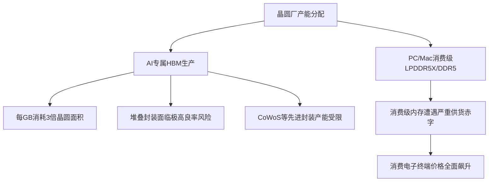

# **被“AI税”绑架的消费电子：苹果全线涨价背后的晶圆绞杀战**

2026年6月25日，苹果做出了多年未见的罕见举动：在产品生命周期中期，宣布对多款核心硬件产品线进行全面涨价。MacBook Neo、MacBook Air、MacBook Pro以及iPad系列的零售价直线上涨100至300美元，高配版本的涨幅甚至更为惊人。苹果CEO蒂姆·库克（Tim Cook）将当前的局面形容为“百年一遇的洪灾”，并直言即使是全球最顶尖的供应链管理大师，也无法在当前的半导体现实中独善其身：“在我过去40多年的职业生涯中，从未在任何领域见过如此严峻的局势。”

这场涨价潮的震源，深埋在AI超大规模云厂商（Hyperscalers）的高密服务器机架中。生成式AI数据中心的爆发式征程，带来了对高带宽内存（HBM3E/HBM4）和企业级SSD近乎无底线的吞噬。面对三星（Samsung）、SK海力士（SK Hynix）和美光（Micron）等内存巨头，AI客户愿意为这些高性能组件支付极高的溢价。在暴利的驱动下，内存厂商正激进地将无尘室空间和晶圆产能从传统的消费级DRAM和NAND闪存中抽离，全力投向AI芯片的生产。

这种产能倾斜的背后，受制于HBM制造过程中冷酷的物理与数学规律——业界称之为“晶圆税”（Wafer Tax），它像多米诺骨牌一样冲击着整个消费级科技市场：
* **晶圆占用面积（Wafer Footprint）**：为了容纳硅通孔（TSVs）和复杂的控制接口，HBM DRAM晶圆的物理面积远大于标准的LPDDR5X。在相同容量下，HBM每千兆字节（GB）消耗的晶圆产能大约是标准DDR5的**三倍**。
* **良率级联效应（Yield Cascades）**：将8到12层晶圆进行垂直堆叠，对制造良率提出了极其苛刻的要求。只要其中任何一层出现微小的次表面缺陷，整个堆叠模组就宣告报废。这导致其净良率远低于单颗芯片的消费级内存。
* **先进封装瓶颈（Packaging Bottlenecks）**：内存厂商不得不将极其稀缺的先进封装产能（如台积电的CoWoS）以及顶尖研发资源优先倾斜给AI产品，这使得消费级PC和移动市场只能去争夺剩下的“残羹冷炙”。

与此同时，高层数3D NAND闪存颗粒被大量挪用于生产高密度企业级SSD（例如用于AI训练集群的30TB和60TB超大容量硬盘），直接榨干了消费级SSD的颗粒供应。市调机构Counterpoint Research的研究总监塔伦·帕塔克（Tarun Pathak）指出，自**2025年第四季度以来，内存原材料的现货价格已飙升超过四倍**。这迫使硬件厂商在前期只能咬牙自行消化成本，直到如今终于触及承受极限。

这起危机彻底颠覆了苹果与供应商之间长期以来的权力博弈。数十年来，苹果凭借无可匹敌的采购规模，习惯在行业低谷期对供应商极限施压。在2023年的全球内存产能过剩期间，苹果就曾强行要求供应商给出“地板价”。美光科技（Micron）首席商业官苏米特·萨达纳（Sumit Sadana）在接受《华尔街日报》采访时，含蓄地批评了这种采购模式。萨达纳指出，在上一次行业低谷期，某些“极具侵略性”的客户将价格压低到了“非建设性”的水平，导致制造商面临负毛利，从而打击了他们投资扩产的积极性。而如今，AI巨头们排着队双手奉上利润丰厚的多年期供货合同，内存大厂们自然不再需要对苹果的霸王条款委曲求全。

苹果的财务指引已经明确显露了这种供应链重压。在2026年第一季度（3月季），苹果录得了49.3%的毛利率；然而，受商品销售成本（COGS）飙升的影响，苹果将第二季度（6月季）的毛利率指引区间下调至**47.5%至48.5%**。

虽然6月25日的涨价风暴暂时放过了iPhone、Apple Watch和AirPods，但分析师们警告称，这不过是暴风雨来临前的短暂平静。IDC高级研究总监纳比拉·波帕尔（Nabila Popal）解释道：
> “iPhone绝不可能独善其身，它的涨价只是时间问题。苹果选择在6月份先对Mac和iPad等次要产品线进行调价，实际上是在缓冲消费者的抵触情绪，以确保秋季旗舰iPhone的发布会不至于完全被‘涨价’这一负面舆论所绑架。”

根据IDC的预测，即将于今年秋季发布的iPhone系列，其平均售价（ASP）预计将面临**11%**的上涨，折合零售价将直接上调**100至200美元**。

> “指望依靠长鑫存储（CXMT）这样名列1260H名单的企业来挽救消费级硬件的利润率，是一个极其严重的错误。这会在最糟糕的时刻加深我们在技术上对中国的依赖。”
> —— 美国众议院美中战略竞争特别委员会主席 约翰·穆勒纳尔（John Moolenaar）

为了寻找替代供货渠道，苹果甚至四处游说美国商务部，试图阻止将中国DRAM制造商长鑫存储（CXMT）列入实体清单。目前，长鑫存储正处于美国国防部的1260H“中国涉军企业”名单中。如果能从长鑫存储采购，将为苹果提供一个宝贵的低成本内存供应阀门。然而，美国众议院美中战略竞争特别委员会主席约翰·穆勒纳尔已公开对此发出警告。

事实上，深陷泥潭的绝非苹果一家。内存短缺已经彻底粉碎了主机游戏行业“发售越久、硬件越贬值”的传统规律：
* **微软（Microsoft）**：宣布将于2026年8月1日起上调Xbox Series X/S的价格，512GB版本涨价**100美元**，1TB版本涨价**150美元**——这是其在13个月内的第三次涨价，同时微软将直接停产2TB版本。
* **索尼（Sony）**：PlayStation 5正面临重大的价格调整压力；有报告指出，由于下一代主机PlayStation 6的物料清单（BOM）成本飙升过快，其发布时间可能会被迫推迟至**2028年或更晚**。
* **任天堂（Nintendo）**：计划于2026年9月起，上调即将推出的Switch 2的上市售价。

正如CyberMedia Research（CMR）副总裁普拉布·拉姆（Prabhu Ram）所言：“在这场AI硬件的军备竞赛中，消费电子产品正沦为无辜的附带受害者。”鉴于美光、台积电和英特尔的新建晶圆厂产能在2028年之前都无法正式投产，普通消费者在未来很长一段时间内，都不得不继续为日常科技产品支付高昂的“AI税”。
