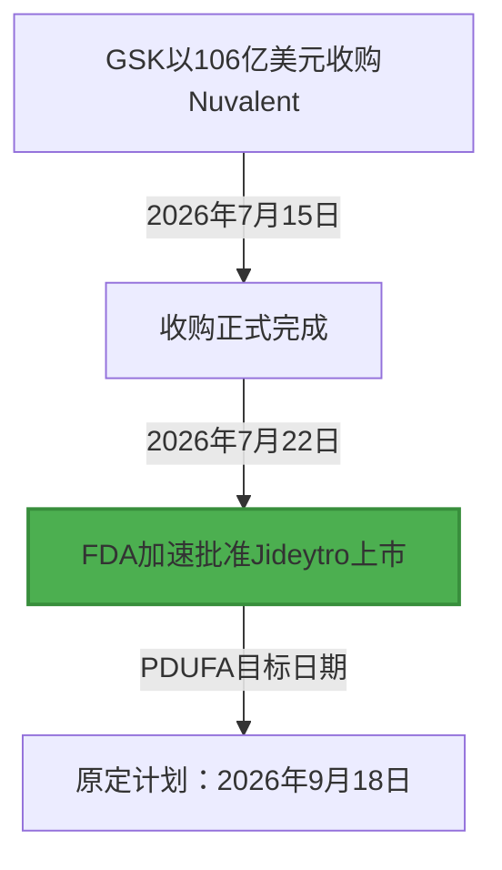

# 解密106亿美元分子棋局：GSK刚获批的Jideytro如何重写激酶耐药代码？

2026年7月22日，美国食品药品监督管理局（FDA）批准了葛兰素史克（GSK）的下一代ROS1选择性酪氨酸激酶抑制剂（TKI）——Jideytro（zidesamtinib）加速上市，用于治疗接受过前线ROS1 TKI治疗后病情进展的局部晚期或转移性ROS1阳性非小细胞肺癌（NSCLC）患者。

这一监管绿灯比原定的9月18日PDUFA目标日期提前了近两个月。而就在一周前，GSK刚刚完成了对Nuvalent公司总额高达106亿美元的全现金收购（每股124美元，溢价率达40%）。对于深谙生物科技与资本运作的行业分析师而言，这场光速获批不仅展示了GSK防御性的管线布局，更是一堂教科书级的基于结构设计药物（Structure-Based Drug Design）的分子工程课。



##### 分子架构：如何绕过G2032R“溶剂前沿”突变

要理解GSK为何愿意为Nuvalent的管线支付106亿美元，必须深入到ROS1激酶结构域的结构生物学层面。

以克唑替尼（第一代，辉瑞的Xalkori）和恩曲替尼（第二代，罗氏的Rozlytrek）为代表的传统TKI，在肿瘤细胞产生耐药性突变后往往会迅速失效。其中最核心的耐药机制，就是著名的**G2032R“溶剂前沿突变”（Solvent Front Mutation）**。

在野生型ROS1蛋白中，第2032位点是一个空间构象灵活的甘氨酸（Glycine）。然而，一旦突变转变为精氨酸（Arginine，即G2032R），就会在ATP结合口袋的入口处引入一个体积庞大且带正电荷的氨基酸侧链。这一变化制造了巨大的空间位阻，将分子量较大、呈线性结构的传统小分子TKI物理性地拒之门外。

```
野生型 ROS1 ATP 口袋：   [甘氨酸 2032] <--- 空间紧凑，传统 TKI 极易结合。
突变型 G2032R ATP 口袋：  [精氨酸 2032] <--- 体积庞大且带电，阻碍传统 TKI 接入。
Jideytro (Zidesamtinib)：[大环支架]      <--- 空间排布高度优化，完美绕过侧链阻碍。
```

为了解决这一痛点，哈佛大学化学与化学生物学教授、Nuvalent科学创始人 Dr. Matthew Shair 带领团队采用了基于结构设计的策略。他们抛弃了线性小分子的思路，将zidesamtinib（研发代号：NVL-520）设计成一个刚性、低分子量且具有特定空间几何形状的**大环化合物（Macrocycle）**。

在2.2 Å分辨率的zidesamtinib与ROS1 G2032R突变体共结晶结构中，这个大环支架在空间上表现出极高的适配度，能够完美地“绕过”发生突变的精氨酸侧链。在史前体外研究中，zidesamtinib针对G2032R突变体的半抑制浓度（IC50）仅为**7.9 nM**，而第一代药物克唑替尼的IC50则高达惊人的**5,700 nM**——两者的分子杀伤效力相差近700倍。

##### 避开TRK：攻克头晕这一“系统Bug”

在激酶抑制剂的分子工程中，选择性（Selectivity）永远是衡量药物性能的终极指标。

作为Jideytro的强劲对手，百时美施贵宝（BMS）的下一代同类新药Repotrectinib（Augtyro）同样表现不俗，但其分子靶向目标同时覆盖了ROS1和TRK（原肌球蛋白受体激酶）家族。然而，在脑部中枢神经系统中，脱靶阻断TRK会引发严重的神经系统毒性。在Repotrectinib的关键性TRIDENT-1临床研究中，约有**65%的患者**出现了限制治疗的眩晕、共济失调或认知障碍。

相比之下，Zidesamtinib在设计之初就确立了“避开TRK（TRK-sparing）”的原则。得益于其高度刚性的大环空间构象，该小分子虽然能严丝合缝地嵌入ROS1结合口袋，但与TRK的ATP结合口袋在空间上会产生位阻排斥。临床前模型显示，zidesamtinib对ROS1的选择性比对TRK高出约**100倍**。

胸外科肿瘤学家 **Dr. Miguel Gonzalez Velez** 在X平台上对这一差异化特性发表了评论：
> “Zidesamtinib获批了……其在客观缓解率（ORR）上处于中游偏上水平（Taletrectinib为55%，Repotrectinib为38%，劳拉替尼为35%），但最显著的差异在于其更好的毒性特征，神经毒性副作用明显减少。”

##### ARROS-1临床数据：攻克脑转移与颅内防御线

在ROS1阳性NSCLC初诊患者中，高达40%的人已伴有脑转移，这使得跨越血脑屏障（BBB）的能力成为衡量新药能否进入一线梯队的硬性指标。Zidesamtinib的紧凑型大环分子设计，使其不仅易于穿过血脑屏障，还能有效逃避脑部血管P-糖蛋白等外排泵的清除。

本次FDA批准的主要依据来自全球Phase 1/2期 **ARROS-1** 临床试验（NCT05118789）：
*   **重度经治患者：** 在117名接受过前线ROS1 TKI治疗并出现耐药进展的患者中，zidesamtinib取得了**44%**的客观缓解率（ORR）。
*   **G2032R突变患者群：** 在携带G2032R“溶剂前沿”突变的亚群中，ORR跃升至**54%**，直接验证了其对耐药机制的精准狙击。
*   **颅内响应率（IC-ORR）：** 在基线伴有脑转移且接受过前线TKI的患者中，颅内客观缓解率达**48%**；而对于前线仅接受过克唑替尼治疗的患者，颅内ORR更是达到了惊人的**85%**。
*   **响应持久性：** 69%的产生缓解的患者，其疗效持续时间（DoR）在12个月以上。

临床安全性数据同样佐证了“避开TRK”设计的成功。整个试验中，仅有**10%的患者**需要降低药物剂量，因不良事件导致终止治疗的比例仅为**2%**。最常见的不良反应仅为轻度的外周神经病变、水肿、便秘、疲劳等，几乎没有观察到与TRK脱靶相关的重度眩晕。

##### 资本的逻辑：为什么GSK不惜重金溢价溢买？

在资本市场看来，GSK这笔106亿美元的重大交易是一次明确的防御性布局，旨在对冲其2028年后核心业务所面临的增长滑坡。在2028年至2030年之间，GSK最重要的抗艾滋病（HIV）核心管线（特别是多替拉韦）将迎来专利到期高峰。

GSK首席商业官 **Luke Miels** 在回应媒体时坦言，这是一笔“多产品组合”的战略收购，能够“立即带来新的销售增长点”，并“为GSK在肺癌治疗领域的版图扩张奠定平台”。

投行 **Jefferies** 的分析师也指出，Nuvalent的管线资产利润率极高，由于耐药控制良好，患者的用药周期长，具备成为超级重磅炸弹的潜力。**Bernstein SocGen** 则在研报中重申了对这笔收购的“跑赢大盘”评级，称其是肿瘤药管线并购领域中少见的能“创造长期增量价值”的正面案例。

##### 用药顺序争议：Jideytro该在何时出场？

随着Jideytro的正式获批，临床医生们开始讨论ROS1抑制剂的最佳用药顺序（Sequencing）。既然Jideytro具有强大的抑制活性和更优越的安全性，是否应当在一线治疗中直接使用，而不是等到患者耐药后再用作挽救治疗？

乔治敦兰巴迪综合癌症中心（Lombardi Cancer Center）的 **Dr. Stephen V. Liu** 在X平台上写道：
> “Zidesamtinib批准用于经前线ROS1抑制剂治疗后的NSCLC患者。虽然后线44%的缓解率和69%的一年DoR已足够让人兴奋，但对于我来说，其在未接受过TKI治疗患者中展现的一线数据（ORR 89%，颅内ORR 83%）才更具震撼力。”

ARROS-1项目的主要临床研究者、纪念斯隆-凯特琳癌症中心（MSKCC）的 **Dr. Alexander Drilon** 总结道：
> “Zidesamtinib是一款高选择性的ROS1抑制剂，旨在彻底解决此前ROS1抑制剂的所有核心局限性，其不抑制TRK的设计让它在同类药物中独树一帜。”

无论Jideytro未来是成为无可争议的一线首选，还是作为攻克G2032R耐药突变的后线王牌，其闪电般的加速获批，都已经标志着化学结构导向药物设计在肿瘤学领域的重大胜利。
