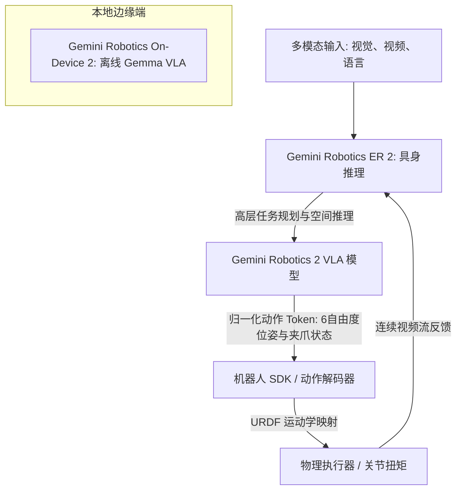

# 解耦VLA与端侧风暴：谷歌DeepMind发布Gemini Robotics 2，吹响机器人“全身智能”的集结号

今天，谷歌 DeepMind 给物理人工智能（Physical AI）领域投下了一颗重磅炸弹：正式发布 **Gemini Robotics 2**。这一全新物理 AI 模型套件的问世，预示着机器与这个混乱、不可预测的现实世界交互方式将迎来根本性变革。多年来，机器人学界一直处于割裂状态：一方是手写物理引擎的拥趸，一方是孤立的关节级控制器研究者，还有一方则是极度依赖云端算力、但在实时延迟上面临严峻挑战的“视觉-语言-动作”（VLA）大模型。Gemini Robotics 2 旨在打破这一僵局。它引入了一种解耦的“三模态”架构（tri-model architecture），旨在跨越不同的机器人形态，协调复杂的全身运动——从行走、蹲下到高灵巧度操作。

DeepMind 将这一版本定位为物理 AI 的完整解决方案，主要由以下三个专业化组件构成：
1. **Gemini Robotics 2 (VLA)：** 旗舰级“视觉-语言-动作”模型，负责底层的全身控制。
2. **Gemini Robotics ER 2 (Embodied Reasoning)：** 高层决策与编排的“大脑”，基于 Gemini 3.5 Flash 架构构建。
3. **Gemini Robotics On-Device 2：** 轻量化的端侧模型，基于 Gemma 构建，专为离线、低延迟执行而优化。

要剖析这一发布背后的工程实践，我们必须深入了解 DeepMind 是如何实现“推理与执行解耦”的，以及它打算如何跨越折磨了机器人学习数十年的“现实鸿沟”（Reality Gap）。

### 架构解析：推理与动作的深度解耦
Gemini Robotics 2 架构的核心在于“关注点分离”（Separation of Concerns）。DeepMind 并没有强求单个庞大的神经网络去同时处理高层语义推理与毫秒级的关节控制，而是将整个流水线一分为二。

其中，**Gemini Robotics ER 2** 扮演着高层协调器的角色。它基于 Gemini 3.5 Flash，不再依赖静态的图像快照，而是持续接收并处理原始的视频和音频流。通过接入 **Gemini Live API** 的双向流媒体功能，ER 2 能够实时感知环境输入，从而彻底消除了传统机器人系统中常见的“停顿思考”尴尬。

DeepMind 披露的 ER 2 内部测试指标非常抢眼：
* **关键时刻定位（Moment Finding）：** 模型能够以 **91.3%** 的准确率识别任务状态的临界转换点（例如螺丝刚好拧紧、或是纸箱盖刚刚合上的瞬间）。
* **时间流逝感知速度（Temporal Speed）：** 执行这些转换的速度比上一代大模型快了 4 倍，事件响应时间差（event-timing distance）平均仅为 **0.96 秒**。
* **进度追踪（Progress Tracking）：** 在包含五个阶段的复杂任务序列中，能够维持 **57.4%** 的进度追踪准确率。

一旦 ER 2 制定好高层规划，它就会将执行权限下放给 **Gemini Robotics 2 VLA** 模型。该模型负责将视觉场景与高层指令转化为**归一化动作空间（Normalized Action Space）**。它不直接输出具体的电机电压或关节扭矩，而是生成代表归一化坐标的离散“动作 Token”（如 6自由度位姿以及夹爪状态的变化）。随后，包含“动作解码器（Action Decoder）”的专属 **Robotics SDK** 会将这些归一化坐标映射到机器人的具体物理配置上（其物理结构由“统一机器人描述格式” URDF 定义）。

### 延迟困境：云端与边缘端的博弈
在机器人领域，延迟不仅是性能瓶颈，更是致命的安全隐患。对于一台双足行走或搬运重物的双足人型机器人来说，如果网络出现轻微抖动，即使电机控制指令仅延迟 200 毫秒，也可能直接导致其失去平衡并发生灾难性的倾倒。

依赖云端部署的 VLA 模型阻碍了其实时安全性。为了攻克这一难题，DeepMind 开发了 **Gemini Robotics On-Device 2**。这款轻量级的 VLA 模型基于 Gemma 端侧模型技术，可以直接在边缘硬件上本地运行。

通过本地化运行，On-Device 2 彻底绕过了云端网络延迟，得以在极高的频率下运转，从而满足连续姿态稳定控制环路的要求。至关重要的是，该端侧模型继承了 Gemini 1.5 时代的先进运动迁移技术（motion-transfer techniques），这使得它在面对全新的机器人配置时，只需耗费不到 **200 个演示样本**，即可在短短几个小时内完成适配。

这种混合部署模式——用云端 ER 2 进行高层语义协调，用本地 On-Device 2 VLA 处理低延迟物理控制闭环——旨在彻底解决具身智能中“强算力”与“快速反应”之间的经典权衡难题。

### 现实鸿沟：Sim-to-Real 与“模仿瓶颈”
或许，现代机器人研究中最激烈的争论莫过于**现实鸿沟（Reality Gap）**——即模拟器训练环境（拥有理想的物理学定律和视觉效果）与混乱无序的现实世界之间的鸿沟。

在过去，研究人员高度依赖大规模的“领域随机化”（Domain Randomization）来跨越这一鸿沟，即在模拟中应用各种怪异的纹理和光照，以使机器人的视觉系统能够推广到物理世界。然而，复杂的接触力学、执行器回程误差（Backlash）以及热漂移等现实物理特性，在虚拟世界中是极难被精确模拟的。

物理智能公司（Physical Intelligence, Pi）联合创始人、加州大学伯克利分校教授 Sergey Levine 长期以来一直指出，纯粹基于人类演示的行为克隆（行为模仿学习）存在根本性的上限。
> “行为克隆和 VLA 模型是不错的起点，但它们很快就会撞上‘模仿瓶颈’。”Levine 指出，“要想获得真正的鲁棒性，模型必须在具备物理一致性的世界模型（World Models）中，以及在真实世界的交互尝试中，通过强化学习（RL）进行微调。”

英伟达（NVIDIA）GEAR 团队负责人 Jim Fan 博士也对纯粹依赖 VLA 架构的做法表达了怀疑。Fan 认为，机器人的“终局”必须转向**世界动作模型（World Action Models, WAM）**：
> “VLA 模型在本质上依然是套上了动作 Token 的‘语言-视觉-动作’模型。真正的世界动作模型不仅要预测下一个动作 Token，更要在其隐藏表征中模拟物理世界的下一个状态，从而建立对物理常识的深度理解。”

为了应对这些质疑，DeepMind 选择将高频模拟与真实世界协同训练相结合。他们与包括 **Apptronik** 在内的机器人 OEM 厂商达成深度合作，在其下一代 **Apollo 2** 人形机器人上开展了实机部署。DeepMind 在其位于德克萨斯州奥斯汀的“机器人公园”（Robot Park）基地收集了海量的遥操作与真实交互数据。此外，为了客观评估这些模型，DeepMind 引入了 **SIMPLER** 评估基准，实现了模拟测试与现实成功率的对齐，并配套使用了其最新的 **ASIMOV-Agentic** 安全框架。

### 异构多机协同编排
Gemini Robotics 2 套件中最引人瞩目的特性之一，是它编排异构机器人团队的能力。在实际的仓储场景中，一项任务往往需要人形机器人、轮式移动操作平台以及固定式机械臂协同完成。

在这套方案的底层，Gemini Robotics ER 2 充当了异构系统的“共享大脑”。由于 ER 2 能够在一个统一的语义上下文中表征任务，它可以将类似于“清理这个工作台并把物品打包”的复杂指令，自动拆解为多个独立的子任务。它通过 3D 边界框预测对空间环境进行建模，通过持续的视频理解追踪每个机器人的工作进度，并进行动态的任务分发。例如，Apollo 2 人形机器人可能会走到货架前取下一箱重物，递给轮式小车；小车再将其运输到打包工位，由一台高速机械臂完成最终封装。整个流程的协调完全不需要在不同的机器之间编写硬编码的通信协议。

### 市场洗牌：硬件 OEM 的平台级转向
对于工业仓储、智能制造及消费级机器人行业而言，Gemini Robotics 2 带来的市场冲击将是颠覆性的。

在过去，机器人企业必须“从零构建”自己的软件栈，雇佣庞大的控制工程团队来编写自定义的运动学求解器和轨迹规划器。而现在，随着谷歌将 Gemini Robotics 2 作为一个通用的物理 AI 平台推出，它显然是想将硬件 OEM 厂商变成 DeepMind 模型层的分发渠道。

Physical Intelligence (Pi) 联合创始人兼 CEO、前谷歌 DeepMind 资深研究科学家 Karol Hausman 揭示了这背后的巨大商业驱动力：
> “行业的终极目标是构建一个通用的物理大脑。一旦你的模型层能够在几个小时内、用极少的数据完成对新机器人硬件形态的适配，硬件本身就会走向白菜价。行业的全部价值都将向上游的模型提供商转移。”

不过，这一转型过程并非没有摩擦。Figure 创始人兼 CEO Brett Adcock 一直在激进地推进人形机器人在制造工厂的部署节点。然而，批评人士警告称，在工业环境中部署需要联网的云端 VLA 模型，将面临严峻的安全、可靠性和数据隐私挑战。车间现场的网络环境向来恶劣，哪怕只是一次网络丢包导致生产线停摆，对汽车制造等重工业厂商而言，就意味着每分钟数万美元的直接损失。

### 物理安全与 ASIMOV-Agentic 评估基准
将体重达 150 磅、拥有整机运动控制能力的人形机器人部署在无结构的环境中，并与人类并肩工作，这引发了极大的安全隐患。与那些被死死锁在安全保护笼里的传统工业机器人不同，人形机器人必须直接与人类操作员共享物理空间。

为了应对这一挑战，DeepMind 推出了 **ASIMOV-Agentic** 评估基准。该框架专门用于衡量具身智能体在以下几个维度的安全编排能力：
* **危险工具拒用（Unsafe Tool Refusal）：** 模型识别并拒绝执行可能造成物理伤害指令的能力（例如拒用“把这个重物扔到那个工人附近”的命令）。
* **不确定性消解（Uncertainty Resolution）：** 系统在缺乏足够物理数据或置信度不足以安全执行任务时，能够主动停下并向人类求助的能力。
* **宪政式引导（Constitutional Steering）：** 引入基于“宪法 AI”（Constitutional AI）制定的“机器人宪法”，确保模型的语义推理在严格的安全边界内运行。

在硬件物理层，这些安全策略由扭矩限制执行器、人体接近传感器以及直接嵌入在 Robotics SDK 本地控制环路中的避障算法提供底层保障。

Gemini Robotics 2 的发布，无疑是通往通用机器人道路上的一个重要里程碑。尽管云端推理层（ER 2）与端侧执行模型（On-Device 2）提供了一套强大的架构范式，但这套技术能否经受住考验，未来的几年里，真正的汽车装配线和繁忙的物流仓库将给出最真实的答案。

---
