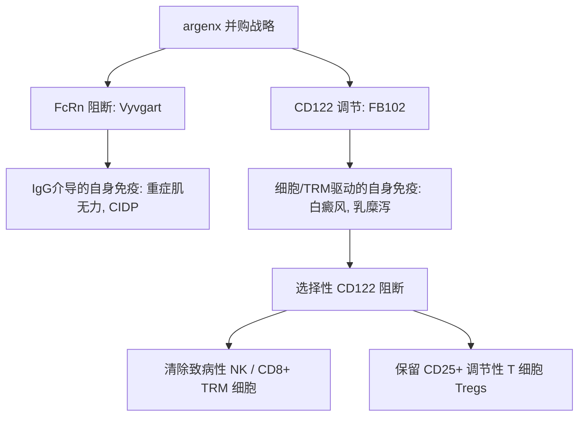

# 超越Vyvgart的下一战：拆解argenx 22亿美元重注CD122背后的自身免疫治愈野心

昨日，**argenx（纳斯达克股票代码：ARGX）**宣布以每股77美元的现金价格收购**Forte Biosciences（纳斯达克股票代码：FBRX）**，交易总估值约为22亿美元。这一重磅消息瞬间在生物医药界激起千层浪，也释放出了一个明确信号：针对靶点选择性免疫疗法的次世代争夺战已正式进入白热化阶段。

此次交易价格较Forte自7月9日公布其核心资产 **FB102** 积极的I/b期临床数据以来的成交量加权平均价溢价达86%。对于凭借重磅FcRn阻断剂Vyvgart（efgartigimod）在重症肌无力（gMG）和慢性端炎性脱髓鞘性多发性神经根神经病（CIDP）等IgG抗体介导的自免疾病市场封神的argenx而言，这笔全现金交易无疑是一次重大的战略性转向——从原有的体液免疫版图跨步迈向以T细胞和天然杀伤（NK）细胞为核心的细胞免疫主战场。



#### 分子机制解密：CD122 / IL-15 / IL-2 轴的精妙设计
要读懂argenx为何愿意为FB102拍出22亿美元的天价，我们需要深入解析白癜风和乳糜泻等慢性炎症疾病的细胞生物学机制。

这两种疾病的核心元凶是**组织驻留记忆T细胞（TRM）**。这是一类定居在特定组织中、极难被清除的“顽固”淋巴细胞。在白癜风中，CD8+ TRM定居在表皮并精准破坏产生黑色素的黑色素细胞；在乳糜泻中，麸质的摄入会触发白介素-15（IL-15）的级联反应，进而激活CD8+上皮内淋巴细胞（IEL）和NK细胞，对肠道粘膜屏障进行系统性破坏。

TRM和致病性NK细胞的存活、增殖及细胞毒性功能高度依赖IL-15信号。而IL-15的受体复合物由IL-15Rα、CD122（IL-2/15Rβ）和CD132（公共γ链）三部分组成。FB102通过特异性结合CD122，阻断了这一功能性受体复合物的组装，相当于断绝了致病性TRM和NK细胞的生存信号，诱导其发生靶向凋亡。

然而，FB102最精妙的分子工程学设计在于其**“保留Tregs”（Treg-sparing）**的特异性。

传统的免疫抑制剂往往采用“地毯式轰炸”的策略，在消灭致病性细胞的同时也将对机体维持免疫耐受至关重要的调节性T细胞（Tregs）一并清除，从而增加患者发生严重机会性感染的风险。虽然Tregs同样表达CD122，但它们还高表达CD25（IL-2受体α亚基），能与CD122及CD132组装成超高亲和力的三聚体IL-2受体。

FB102在物理化学特性上经过精细调校，仅阻断效应T细胞和NK细胞表面上中等亲和力的二聚体IL-2/IL-15受体（CD122/CD132），而不影响Tregs表面上的高亲和力三聚体受体信号。这意味着在强力踩下致病性效应细胞“刹车”的同时，机体自身的免疫保护伞（Tregs）依然能正常工作。

| 受体亚型 | 包含亚基 | 主要细胞类型 | FB102 的作用机制 |
| :--- | :--- | :--- | :--- |
| **高亲和力 IL-2 受体** | CD25 / CD122 / CD132 | 调节性 T 细胞 (Tregs) | 保留 / 信号传导不受影响 |
| **中亲和力 IL-2/15 受体** | CD122 / CD132 | 效应 T 细胞、NK 细胞、TRM 细胞 | 阻断 / 诱导细胞凋亡 |

---

#### 临床数据拆解：引爆收购战局的导火索
过去一年里相继出炉的临床数据，证实了这一精妙的选择性机制确实能够转化为显著的临床获益，这也直接引燃了资本市场的热情。

##### 1. 白癜风治疗新突破（Phase 1b - 2026年7月）
在一项包含43例患者的双盲、安慰剂对照试验中，FB102在活动性白癜风患者中展现出了前所未有的疗效：
* **主要终点疗效**：在符合方案的疗效评估人群（32例接受FB102治疗，10例接受安慰剂）中，治疗第24周时，FB102组患者的面部白癜风面积评分指数（FVASI）平均改善了**29.6%**，而安慰剂组仅改善了7.9%（$p = 0.020$）。
* **重度患者疗效更优**：在基线FVASI $\ge 0.75$ 的重度患者中，FB102组的平均改善率达到 **43.2%**，相比之下安慰剂组仅为0.5%。在该重度亚群中，有 **58.8%** 的患者在第24周达到了 FVASI50（面部脱色面积减少50%），**23.5%** 的患者达到了 FVASI75。
* **“疾病修饰”的可持续疗效**：患者在第12周已停止给药，但其表皮重色素沉着在停止给药后仍持续好转至第24周。这表明FB102可能已经从根本上清除了皮肤中的致病性TRM“储水池”，让黑色素细胞得以自然恢复——这与许多仅具一过性疗效的疗法相比，具有颠覆性的竞争优势。

##### 2. 乳糜泻概念验证（Phase 1b - 2025年6月）
目前全球尚无任何获批用于乳糜泻的药物。在FB102-101的I/b期试验中，受试者接受了为期16天的严格麸质挑战：
* **病理组织学保护**：在绒毛高度与隐窝深度比及上皮内淋巴细胞（VCIEL）综合评分中，FB102治疗组显示出对肠道粘膜形态的显著保护作用，降低了CD3+上皮内淋巴细胞（IEL）的密度，并稳定了绒毛高度与隐窝深度（VH:CD）的比例。
* **临床症状缓解**：与安慰剂组相比，接受FB102治疗的患者由麸质引起的胃肠道症状（包括恶心、腹胀和腹痛）减少了**42%**。

---

#### 商业图景：argenx 的“Vision 2030”蓝图
这笔高达22亿美元的豪赌，是argenx管理层（以首席执行官 Karen Massey 和董事会主席 Tim Van Hauwermeiren 为核心）深思熟虑后的关键决策。

在 **“Vision 2030: 将突破性科学带给50,000名患者”** 的战略计划下，argenx 明确了三大2030年愿景：
1. 全球服务患者达到50,000人；
2. 拿下10个获批适应症；
3. 推动5个新分子进入III期临床。

```
          [ argenx "Vision 2030" 战略目标 ]
  ┌────────────────────────────────────────────────────────┐
  │ 1. 治疗全球 50,000 名患者                              │
  │ 2. 获得 10 个适应症批准                                 │
  │ 3. 推动 5 个全新分子进入 III 期临床试验                 │
  └───────────────────────────┬────────────────────────────┘
                              │ （战略催化剂）
                              ▼
                [ 收购 Forte 获得核心资产 FB102 ]
  ┌────────────────────────────────────────────────────────┐
  │ • 引入同类首创（First-in-class）的 CD122 单抗          │
  │ • 加速推进乳糜泻与白癜风的 II 期临床试验               │
  │ • 实现技术平台多元化，突破单一 FcRn 依赖               │
  └────────────────────────────────────────────────────────┘
```

Vyvgart虽是不折不扣的吸金怪兽，但作为单一技术平台（FcRn阻断），它终将面临市场饱和以及生物类似药的激烈竞争。FB102代表了完美的第二支柱。因为CD122靶点所针对的是完全不同的生物学通路（T细胞/NK细胞细胞因子信号通路，而非单纯清除IgG自身抗体），它成功将argenx的商业触角延伸至乳糜泻和白癜风等Vyvgart无法发挥生物学活性的自免细分市场。

---

#### 工程学与商业量产的暗礁
尽管临床前景诱人，但argenx在扩大FB102生产规模并实现商业化的道路上，仍需面临重重技术挑战：

1. **靶点介导的药物清除（TMDD）**：由于CD122在循环NK细胞和记忆T细胞上高度表达，外周血中的这些细胞就像是一个巨大的“海绵”（TMDD效应）。在给药后，大部分抗体分子会被外周循环细胞迅速结合并清除，难以有效渗透到皮肤或肠道等靶组织中。这迫使临床必须采用高剂量给药方案，对产能提出了极大挑战。
2. **皮下注射剂型的开发难关**：自免慢性病是一块巨大的门诊/院外市场，这要求FB102必须以皮下注射（SC）而非静脉输注（IV）的形式给药。然而，若要通过皮下注射输送高剂量药物，抗体溶液浓度必须达到100 mg/mL以上。这种高浓度往往伴随着粘度飙升和蛋白聚集问题。argenx很可能需要利用其与Halozyme的ENHANZE皮下递送技术的合作关系，来克服这些物理特性瓶颈。
3. **免疫原性风险**：在非致命的慢性疾病中长期使用单克隆抗体，极易诱发患者产生抗药抗体（ADA），这可能会中和药物疗效，甚至引发超敏反应。

---

#### 群雄逐鹿：日趋惨烈的自免竞争格局
argenx 杀入的并非无人之境，白癜风和乳糜泻赛道的竞争已经异常惨烈：

* **皮肤科（白癜风）**：因塞特（Incyte）推出的外用芦可替尼乳膏（**Opzelura**）目前是这一领域的主流疗法，但其受限于局部涂抹，且带有黑框警告。此外，艾伯维（AbbVie）的系统性JAK抑制剂**乌帕替尼**正在快速推进，但也伴随着较广泛的免疫抑制风险。值得注意的是，Royalty Pharma支持的梯瓦（Teva）抗IL-15单抗 **TEV-53408** 计划于2026年第四季度进入IIb期临床，直接对标FB102。
* **胃肠病科（乳糜泻）**：赛诺菲（Sanofi）通过收购Provention Bio获得的抗IL-15单抗 **PRV-015**（ordesekimab）已进入IIb期，是极具威胁的对手。不过，由于PRV-015仅阻断IL-15，它无法阻断由IL-2介导的致病性T细胞活化。此外，First Tracks Biotherapeutics 也在积极推动其抗CD122单抗 **ANB033** 进入临床研究。

---

#### 行业反响与分析师观点
这笔交易公布后，华尔街分析师和生物医药界资深人士迅速展开了讨论。

知名生物医药投资人、Biotech ETF创立者 **Brad Loncar** 在社交媒体X上表示：
> “argenx收购Forte Biosciences是成熟商业巨头的一场教科书般的操作。人人都知道Vyvgart的上市表现是历史级额，但在如今的自免市场中，你绝对不能只当‘独脚戏演员’。拿下FB102，意味着argenx在白癜风和乳糜泻领域瞬间握有了极富想象力的选择权。86%的溢价虽然不菲，但如果2026年底乳糜泻的II期数据足够亮眼，这22亿美元就会显得像是在‘捡漏’。”

在 Reddit 的 r/biotech 版块中，业内研究人员更加关注其“Treg-sparing”机制：
> “CD122赛道之所以被称为雷区，是因为如果阻断过于剧烈，极易把Tregs也顺便搞掉，进而导致全身性的自身免疫疾病——这与我们的初衷背道而驰。”一位资深免疫学家指出，“Forte在I/b期临床中展现出的既能保护VH:CD比值、又能完美保留Tregs的数据，才是这笔交易最核心的底层逻辑。如果argenx能解决好商业量产和皮下注射剂型的稳定性问题，这个产品本身就足以撑起一条完整的产品线。”

然而，STAT News名记 **Adam Feuerstein** 则持相对谨慎的态度：
> “白癜风数据确实很漂亮，但真正的战场是乳糜泻。FDA历史上还从未批准过任何一款乳糜泻治疗药物。I/b期试验中使用的麸质挑战模型虽然完成了概念验证，但要开展一项在真实世界膳食暴露环境下的III期大规模临床试验，其物流组织和监管审查难度无异于一场灾难。argenx买下了顶尖的科学研究，但后续的执行风险依然非常高。”

随着这项收购预计于2026年环境完成，且乳糜泻的II期临床数据有望于今年下半年公布，全球医药界的目光将聚焦于FB102能否保持其临床优势，并最终兑现argenx在这场百亿自免未来押注中的全部期许。

---
