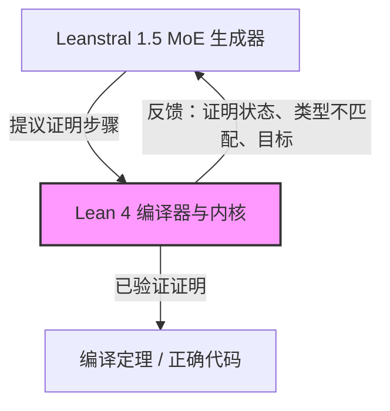

# **超越代码生成：Mistral 发布 Leanstral 1.5，神经-符号循环将如何重构形式化数学与安全工程？**

2026年7月2日，开源AI领军者Mistral AI宣布以 Apache 2.0 协议正式开源 Leanstral 1.5 模型，并在其官方平台发布了题为《Leanstral 1.5：人人享有的证明丰饶》的深度技术公告。这一动作标志着开源 AI 社区正试图摆脱目前流于表面、只求语法通顺却缺乏逻辑验证的“氛围编程”（Vibe-coding）。作为一款专为对接 Lean 4 编译器循环而设计的混合专家（MoE）系统，Leanstral 1.5 旨在将高门槛的形式化数学验证与自动定理证明，带入主流软件工程的日常工作流中。

在此之前，形式化验证（Formal Verification）几乎是学术界和航空航天、硬件设计等极高安全等级领域的专属玩具。而 Mistral 试图通过 Leanstral 1.5 将这一技术民主化。它不仅在顶级数学竞赛中展现了前沿（State-of-the-art）实力，更直接在生产级的开源项目库中挖出了多个隐蔽的零日漏洞（Zero-day bugs）。

### 神经-符号架构：CISPO 强化学习与 Yann LeCun 的“世界模型”之争

Leanstral 1.5 采用了稀疏混合专家（MoE）架构，总参数量达 1190 亿，每个 Token 激活的活跃参数量为 65 亿。这种动态路由设计在保证推理成本经济性的同时，使模型能够承载庞大的数学引理库和编程语义知识。

为了应对形式化证明中漫长的逻辑链条，Leanstral 1.5 配备了高达 256k Token 的超长上下文窗口。在形式化数学中，一个定理的证明往往需要导入 Lean 的标准数学库（Mathlib）中庞大的依赖树。这需要模型在编译定理时，时刻保持对成千上万行导入、类型定义和辅助引理的全局感知。256k 的上下文让 Leanstral 能够一次性吞下整个源文件及其直接依赖，规避了因过度使用检索增强生成（RAG）而丢失关键类型信息的弊端。

在训练方法论上，Mistral 展现了向“闭环环境强化学习（RL）”的彻底转变：
1. **监督微调（SFT）：** 在海量形式化证明与代码翻译数据上进行预训练。
2. **基于 CISPO 的强化学习：** Mistral 引入了一种名为 CISPO（约束迭代自我博弈优化，Constrained Iterative Self-Play Optimization）的专属强化学习算法。在此阶段，Leanstral 1.5 扮演一个多轮定理证明循环中的智能体（Agent），直接与 Lean 4 编译器内核进行实时交互。Lean 4 的类型检查器充当了一个绝对不产生“逻辑幻觉”的验证器：一旦编译器报错，模型会立刻收到负反馈，并强制进行回溯，探索另一条证明路径。

这种“神经-符号（Neural-Symbolic）”的闭环系统，有力回应了 Yann LeCun 对纯自回归大语言模型（LLM）的经典批判。LeCun 曾指出，自回归 LLM 缺乏内部的世界模型或规划引擎，因此无法进行真正的推理。而通过将 Leanstral 与 Lean 4 编译器强行绑定，Mistral 为大模型装上了一个符号规划引擎。大模型负责发散性、创造性的搜索空间，而编译器则坚守逻辑的铁律。

### 屠榜 PutnamBench，形式化数学的跃迁

Leanstral 1.5 在数学基准测试中的表现，让传统的通用大模型相形见绌：
*   **miniF2F：** 该模型已在这个高中奥数级别的测试集中达到 100% 的满分饱和状态。
*   **PutnamBench：** 在包含 672 道极具挑战性的大学本科数学普特南竞赛题中，Leanstral 1.5 成功解出了其中的 587 道。相比之下，此前的大模型在面对这一测试集时往往只能解出极少的一部分。
*   **FATE-H 与 FATE-X：** 在“形式化代数定理评估”基准测试中，Leanstral 1.5 在硕士级别的 FATE-H 上拿到了 87% 的高分，而在难度极高的博士级别 FATE-X 上也取得了 34% 的突破。

这表明，Leanstral 成功克服了 GPT-4 或 Claude 3.5 Sonnet 等通用模型中常见的“逻辑幻觉”——后者常常能写出看起来逻辑自洽、实则暗藏致命逻辑漏洞的证明步骤。

菲尔兹奖得主、形式化数学的积极倡导者陶哲轩（Terence Tao）对此评价道：“我们正在目睹数学研究从纯手工业，向‘人机协同、编译器验证’的混合范式过渡。AI 探索搜索空间并由内核实时验证的能力，彻底改变了我们构建证明的方式。”

### Mathlib 瓶颈与“未形式化数学”的业界争论

尽管表现亮眼，Leanstral 1.5 依然在 Hacker News 和 Reddit 上引爆了激烈的技术争论。核心焦点在于：编译器集成智能体的能力上限，是否被 Lean 现有的标准库 Mathlib 锁死了？

由于 Leanstral 极度依赖 Lean 编译器来验证输出，它目前只能证明那些能够用 Lean 4 表达的概念。如果某个数学概念尚未在 Mathlib 中被形式化定义，模型就无法引用它。对此，持怀疑态度的开发者认为，这限制了模型发现“全新数学定理”的能力。

Reddit 的 r/LocalLLaMA 板块上，一位用户评论道：“Leanstral 极其擅长修补已知数学版图的拼图，但它本质上是一个‘保守型’智能体。在人类写出 Lean 定义之前，它缺乏表达新数学范式的词汇表，因而无法创造新的数学。”

而支持者则认为这一瓶颈是暂时的。Lean 的创造者、Lean 聚焦研究组织（FRO）首席架构师 Leonardo de Moura 强调，随着 Mathlib 形式化规模的持续扩大，模型的搜索空间也将呈现指数级扩张。

### 深入生产一线：用形式化证明排查真实软件漏洞

在纯数学之外，Mistral 正试图将 Leanstral 1.5 打造为软件安全领域的终极工具。Mistral 通过扫描 57 个开源软件库对该模型进行了实战测试。其工作流引入了 Rust-to-Lean 4 翻译器——Aeneas。

Rust 代码被 Aeneas 转化为 Lean 4 的形式化规范（Specifications）后，Leanstral 1.5 扮演自主智能体，读取文件、自动生成形式化规格说明，并试图证明代码的行为完全符合这些规范。

测试结果令人瞩目：
*   标记了 **47 处** 违反属性的行为；
*   确诊了 **11 个** 真实的逻辑漏洞，其中 **5 个** 是此前从未被发现的零日（Zero-day）漏洞。

其中最典型的一个案例，发生在 Rust 库 `datrs/varinteger` 的 zigzag 解码函数中。代码中存在一个致命的整型溢出漏洞：当输入为 `Std.U64.MAX` 时，表达式 `(value + 1)` 将发生溢出。这在 Debug 模式下会导致程序崩溃（Panic），而在 Release 模式下则会引发无声的数据损坏。Leanstral 1.5 精准锁定了这一边界条件，并提供了一份经过编译器验证的修复补丁。

这在 Hacker News 上引发了针锋相对的辩论。有用户指出，该漏洞在 Mistral 发布博客前不久刚被其他开发者独立报告，并认为传统的属性测试（Property-based testing）或模糊测试（Fuzzing）同样可以捕获它。然而，形式化验证的拥趸反驳道，模糊测试本质上是基于概率的用例运行，而 Leanstral 提供的数学证明，则从逻辑上彻底保证了该漏洞在任何可能输入下都被消灭。

### 开源 Apache 2.0 与形式化开发的未来

Mistral 将 Leanstral 1.5 以 Apache 2.0 协议开源，并提供免费的 API 节点（`labs-leanstral-1-5`），这一策略极具野心。将权重托管在 Hugging Face，意味着企业可以在本地私有部署这套形式化验证管线。对于国防、医疗设备、航空航天和密码学等对代码隐私敏感的安全攸关（Safety-critical）行业来说，无需将专有代码上传至闭源云端 API 是不可妥协的前提。

随着像 Leanstral 这样与编译器深度融合的智能体走向成熟，整个科技行业可能会迎来从“先写代码，后做测试”向“先写规格说明，后生成证明代码”的范式转移。尽管开发者社区对于形式化验证的现实落地成本仍有争议，但 Leanstral 1.5 已经用实打实的战绩证明：符号编译器与神经网络的融合，正在走出象牙塔，走向真实的生产环境。
