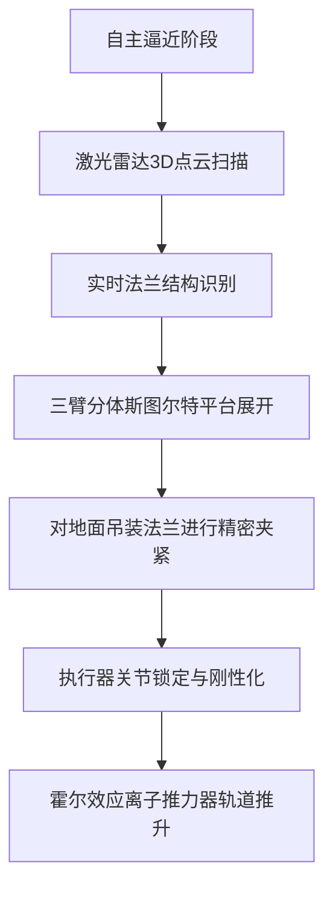

# **轨道心肺复苏术：直击Katalyst拯救NASA“雨燕”天文台的250天生死时速，与太空升级经济的黎明**

2026年6月27日，诺斯罗普·格鲁曼公司的洛克希德L-1011“观星者”（Stargazer）载机将从瓜加林环礁的罗纳德·里根弹道导弹防御试验场起飞。升至太平洋上空4万英尺的高度后，它将释放一枚“飞马座XL”（Pegasus XL）火箭。火箭点火后，将把一个冰箱大小的载荷送入近地轨道（LEO）。

这个载荷名为**LINK**（轻型空间导航与运动学航天器），是由亚利桑那州弗拉格斯塔夫的初创公司**Katalyst Space Technologies**研制的在轨服务航天器。它的拯救目标，是NASA著名的**尼尔·格雷尔斯雨燕天文台**（Neil Gehrels Swift Observatory）——这台于2004年发射、已服役22年的伽马射线暴探测器，是高能天体物理学的基石。

这绝非一次例行任务，而是一场耗资3000万美元、历时250天的轨道紧急救援。它代表了目前“在轨服务、装配与制造”（ISAM）领域的最高水平。如果成功，它将改写太空运营的经济学模式，将卫星从一次性的资本开支黑洞，转变为可动态升级的在轨资产；而一旦失败，则可能在拥挤的近地轨道上撞击出一片高速飞行的碎片云。

### 偶像的衰变：第25个太阳活动周期夹击“雨燕”
自2004年11月发射以来，“雨燕”天文台一直扮演着宇宙中最敏锐的伽马射线暴哨兵角色。然而，它有一个致命的阿喀琉斯之踵：没有搭载推进系统。在二十多年的服役期内，受微弱的大气阻力影响，它的轨道高度已从最初的600公里慢慢滑落至约400公里。

而**第25个太阳活动周期**的爆发，极大地加速了这一衰变过程。当前的太阳活动极大期将强烈的紫外线辐射倾泻进地球上层大气，加热并膨胀了热层。这种“大气膨胀效应”让“雨燕”承受了远超预期的阻力，面临在2026年底前失控重入大气层烧毁的绝境。为此，NASA在2026年2月紧急暂停了“雨燕”的大部分科学观测，停止了其望远镜的指向机动，以最小化迎风截面积，勉强拖延时间。

对于NASA而言，失去“雨燕”意味着在高能天体物理领域失去双眼。然而，重新建造一台替代望远镜将耗资超过2.5亿美元，且需耗时数年。2025年底，NASA做出了一个极具胆识的抉择：向Katalyst公司授予一份价值3000万美元的合同，设计、建造并发射一个机器人航天器，与“雨燕”强行对接，并将其推回600公里的安全轨道。

### “非合作式对接”：硬核太空工程的噩梦
要理解这项任务为何让整个航天界屏息以待，必须审视对接目标的残酷现状。“雨燕”是在太空资产被视为“一次性消耗品”的时代建造的。这意味着它身上：
* 没有任何对接环或机械接口。
* 没有磁性锁扣。
* 没有光学逆向反射器或任何便于导航的合作标志。
* 拥有极其脆弱且老化的太阳能电池板，以及高灵敏度的仪器（如X射线望远镜和紫外/光学望远镜），极易被外部强光或撞击损毁。

这是一次典型的**非合作式对接**（Non-cooperative docking）。LINK必须在一台完全无法提供配合、甚至无法自主稳定的卫星上完成逼近、抓取和推升。

“在一颗设计之初从未考虑过被外力触碰的卫星上进行近距离操作和对接，几乎是轨道动力学中难度极高的挑战，”Rocket Lab首席执行官彼得·贝克（Peter Beck）在谈及ISAM任务的复杂性时表示，“容错率是零。如果逼近距离算错了几厘米，就会演变成一场高速太空相撞。”

更令人意想不到的是历史档案的缺失。“我们在与一个22年前制造的航天器打交道，”Katalyst创始人兼首席执行官李坤熙（Ghonhee Lee）解释道，“没有预留的发射前背部实物照片，历史CAD图纸也不完整。我们必须在轨实时重建它的结构模型并完成对接。”

### GNC与LiDAR导航栈的算力对决
由于缺乏预先的视觉参考，LINK无法依赖传统的目标模板匹配计算机视觉。相反，其制导、导航与控制（GNC）系统完全围绕主动式**LiDAR（激光雷达）传感器**与实时3D重建算法构建。

在交会与近距离操作（RPO）阶段，LINK将执行缓慢的相位逼近，并使自己的轨道速度和倾角与“雨燕”精准同步。在距离100米时，LINK的激光雷达将开始发射脉冲光，在漆黑的太空中重构出目标的高分辨率三维点云。

LINK的在轨飞行计算机运行着自主导航算法，将实时点云与残缺的旧结构数据进行比对。算法的核心任务，是寻找“雨燕”主框架上的**地面转运吊装法兰**（ground handling transportation flanges）。这些法兰是2004年发射前用于起吊和运输望远镜的狭窄金属环，也是整个“雨燕”外壳上唯一能够承受对接夹持力、而不至于导致机身皮肤塌陷的承重结构。

### 拆分式斯图尔特平台的精巧抓取
为了牢固锁紧这些地面法兰，Katalyst开发并申请了专利机器人捕获机构——**拆分式斯图尔特平台**（Split Stewart Platform）。

传统的斯图尔特平台是一种常用于飞行模拟器和精密加工的六自由度并联机构。而Katalyst的“拆分”设计，则由**三条独立、可折叠且可调的机械臂**组成，它们呈环状安装在LINK航天器的机身上。

三条机械臂独立运行但高度协同：
1. **动态展开**：当LINK切入最后几米距离时，三条机械臂展开。
2. **激光雷达对齐**：机械臂关节处的微型传感器利用近程LiDAR，将夹爪与“雨燕”法兰的对准精度控制在毫米级。
3. **闭合夹持**：特制夹爪在法兰上闭合，锁紧受体。
4. **刚性化**：一旦三个夹爪全部锁死，机械臂的执行器将锁定关节，在LINK和“雨燕”之间建立一条坚固的结构刚性桥梁。

### 轨道推升：质心与推力的微米级博弈
建立刚性连接后，推升过程同样如履薄冰。这绝非简单地点燃发动机。

由于“雨燕”是一个沉重且不对称的物体，LINK施加的任何推力线如果未能完美穿过双星组合体的新**共同质心**，都将产生巨大的旋转力矩，导致两个航天器陷入失控的翻滚。

这正是拆分式斯图尔特平台可调性的关键所在。机械臂可以微调LINK相对于“雨燕”的相对几何位置，直到LINK的推进线与共同质心重合。

为了防止化学火箭的猛烈爆发产生剪切力折断那几个旧法兰，LINK舍弃了高推力发动机，转而采用低推力、高比冲的**霍尔效应离子推力器**。LINK将在数周内进行持续而温和的电推进燃烧，缓慢地将这一“合体卫星”的高度重新拉回到600公里。

### 凯斯勒危机：失败的代价
如果此次对接失败，代价将是无法承受的。“雨燕”所处的近地轨道目前已拥挤不堪。对接阶段一旦发生碰撞，两颗航天器都将瞬间碎裂。

在约7.8公里/秒的轨道速度下，即使是轻微的擦碰，也会制造出数千个可追踪的太空碎片和数百万个无法追踪的弹片级金属碎屑。这些碎片将呈扇形散布在近地轨道中，对其他科研和军事卫星构成长期威胁，甚至可能引发连锁碰撞的**凯斯勒现象**（Kessler Syndrome），导致特定轨道扇区在未来几十年内彻底瘫痪。

### 宏观产业演进：迈向在轨升级经济
“雨燕推升”任务的商业涟漪远不止于挽救一台望远镜，它是太空工业从“单次使用”向“在轨升级”时代过渡的宏观试验。

2025年4月，Katalyst完成了对**Atomos Space**的收购，整合了其位于科罗拉多州布鲁姆菲尔德的工厂及其**Quark**轨道转移飞行器（OTV）技术。这使Katalyst能够将定制对接机构与成熟、可扩展的卫星平台相结合。收购完成后，Atomos联合创始人瓦妮莎·克拉克（Vanessa Clark）加入Katalyst，极力倡导太空常驻物流网络：“通过整合OTV技术，我们正在建设太空常驻物流网络的基石，雨燕推升任务将是这一愿景的终极证明。”

硅谷顶尖太空风投也高度关注这一转变。“太空正在从‘部署并祈祷’的世界转变为‘部署并服务’的世界，”Founders Fund合伙人兼Varda Space Industries联合创始人德里安·阿斯帕鲁霍夫（Delian Asparouhov）指出，“在轨物流将使太空资产像软件一样实现动态升级。当你的汽车没油或需要更换轮胎时，你不会把它扔掉；我们对待卫星也不该如此。”

在LINK任务之后，Katalyst计划于2027年推出**NEXUS**平台，这是一款体量更大、具备地球静止轨道（GEO）运营能力的机器人服务平台，旨在提供燃料加注、硬件换装和卫星重新定位等服务。

### 国防与弹性太空行动的伏笔
美国太空军也在密切注视着这次发射。自主交会、检查并服务一颗非合作卫星的能力，本质上是一种具有巨大军事价值的双用途技术。

在未来的轨道冲突中，对手可能会试图瘫痪或窥探美国的军事卫星。为LINK开发的这套技术——自主近距离操作、分体斯图尔特平台以及实时三维建模——正是以下行动的核心工具链：
* **战术响应式空间行动**：快速部署在轨服务船，为受损或耗尽燃料的军事卫星实施抢修与补给。
* **空间态势感知（SDA）**：贴近未知或非合作的轨道目标，检查其是否携带威胁性载荷。
* **动态太空行动**：将高价值军事资产移出威胁轨道，并为其补充推进机动能力。

随着“观星者”载机为2026年6月27日的起飞做最后准备，“雨燕”拯救任务已不再仅仅是一场科学观测寿命的延续，它拉开了轨道生产力变革的序幕。

---
