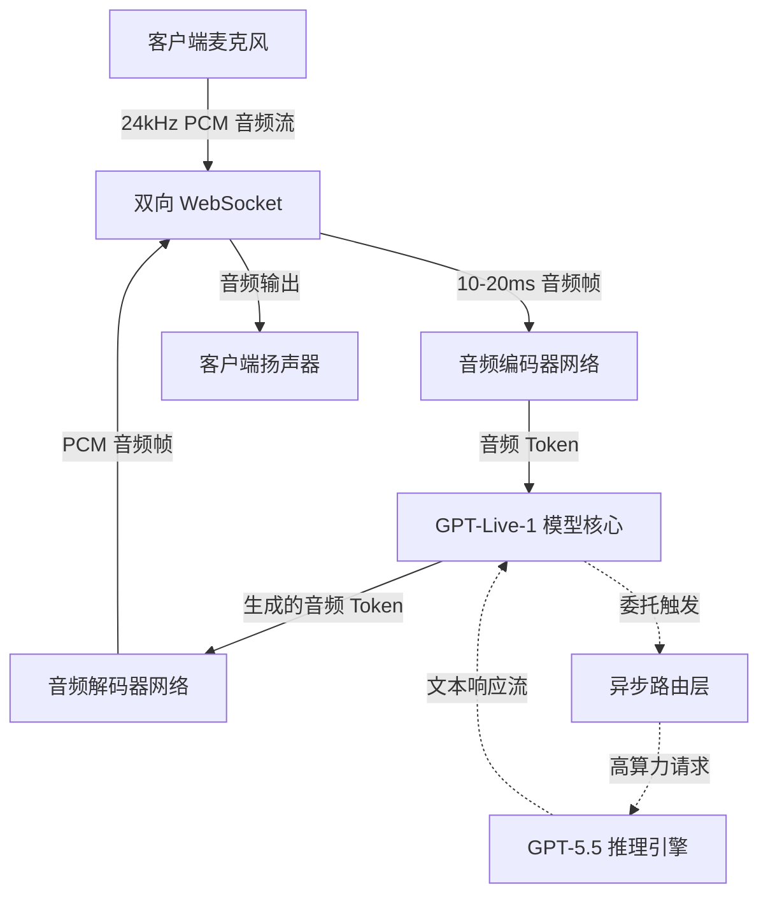

# 迈向原生语音时代：OpenAI GPT-Live 全双工架构如何将 WebSockets 与 GPU 集群推向极限

2026年7月8日，OpenAI 正式发布 GPT-Live。这一划时代的产品不仅标志着人机交互范式的重塑，也宣告了传统“对讲机式”半双工语音助手的终结。多年来，与 AI 语音助手的交互始终伴随着强烈的迟滞感——ASR（语音识别） $\rightarrow$ LLM（大语言模型推理） $\rightarrow$ TTS（语音合成）的传统级联管道，不可避免地带来了 1.5 至 3 秒的延迟瓶颈。更致命的是，这种架构在结构上无法处理“插话”：一旦用户在 AI 说话时开口，系统也无法立即收声，必须等底层的音频缓冲区完全清空才能做出反应。

GPT-Live-1 和 GPT-Live-1 mini 彻底摒弃了这种落后的瀑布流式设计，转而采用原生的双向“语音到语音”（Speech-to-Speech）架构。系统通过持久的双向 WebSocket 连接，直接吞吐原始音频流（24kHz、16位单声道 PCM，采用 G.711 或 Opus 编码）。该音频流被切片为 10–20 毫秒的超短帧，并直接输入音频编码器网络。模型以原生方式处理音频 Token，将其投影到连续隐空间中，并实时生成对应的音频 Token 流式传回客户端，将整体响应延迟压缩至 200 毫秒以内。

为了实现这种行云流水般的对话体验，OpenAI 必须攻克两大底层技术难关：语义级语音活动检测（Semantic VAD）与异步后台委托机制（Asynchronous Background Delegation）。



传统的 VAD（语音活动检测）库主要依赖简单的信噪比（SNR）阈值来识别静音。在真实的实时对话中，这会导致 AI 在用户轻微停顿时粗暴地切断发言，或者忽略自然的人际附和（例如“嗯”、“好”等 backchannel 信号）。GPT-Live 的解决方案是，将服务端语义级 VAD 直接集成到音频编码器中。模型会持续评估输入流的语言意图：如果用户只是发出无伤大雅的附和，AI 将继续侃侃而谈；而一旦检测到真正的打断意图（如“等等，先停一下”），服务端会瞬间触发取消事件（`response.cancel`）。

然而，一旦发生打断，服务端就必须面对棘手的“KV 缓存截断问题”（KV Cache Truncation Problem）。由于 Transformer 模型生成的 Token 进度通常超前于客户端实际播放的进度，服务端必须让模型的内部记忆与用户实际听到的内容保持绝对同步。此时，客户端会向服务端报告已停止播放音频的精确毫秒偏移量，服务端据此执行 `conversation.item.truncate` 事件。该操作在对应打断位置的精确 Token 处截断 KV 缓存，丢弃所有提前生成的超前 Token。如果缺少这一回滚机制，模型的对话记忆就会与用户的听觉感知发生脱节，进而引发严重的上下文漂移（Context Drift）。

此外，为了维持 sub-200ms 的极速音频循环，GPT-Live-1 必须采用体积更小、速度经过极致优化的模型。这也意味着它无法在实时对话中直接运行复杂的数学推理或深度全网搜索。为了弥补这一短板，OpenAI 引入了智能体级联委托协议（Agentic Cascade Delegation Protocol）。当用户提出高算力需求时，GPT-Live-1 会自动将请求分流至后台的高阶推理引擎——于 2026 年 4 月发布的 GPT-5.5。

```
[用户] "当 x = pi 时，x^2 * sin(x) 的导数是多少？"
   |
   v
[GPT-Live-1] (延迟：~150ms)
   |-- 意识到需要复杂的数学推理。
   |-- 派生后台线程委托给 GPT-5.5。
   |-- 生成口头填充语（垫片）：“我们来算一下这个……”
   |
   v
[GPT-5.5 推理引擎] (延迟：~3.2s)
   |-- 执行思维链（CoT）Token。
   |-- 求解：在 pi 处求 2x*sin(x) + x^2*cos(x) 的值 -> -pi^2。
   |-- 将文本方案流式传输给 GPT-Live-1。
   |
   v
[GPT-Live-1] 
   |-- 接收到答案："-pi^2"。
   |-- 语音合成（TTS）流输出：“利用乘积法则，导数是……在 pi 处的值为负的 pi 平方，约等于 -9.87。”
```

为了掩盖后台模型 3 到 5 秒的推理延迟，GPT-Live-1 会极其自然地生成“口头垫片”或语气填充词（如“让我想想……”或伴随思考的“嗯……”）。一旦后台的 GPT-5.5 完成逻辑推理，其文本输出就会被无缝注入 GPT-Live-1 的语音生成队列中。在最终输出整合完毕后，系统会立即丢弃 GPT-5.5 庞大的思维链 KV 缓存，从而将客户端会话的内存占用维持在极低水平。

尽管这一架构堪称技术奇迹，但其商业化落地却面临着残酷的算力成本与社会阻力。目前，Plus（20美元/月）与 Pro（200美元/月）订阅用户正受到严格的动态使用限制，单次通话往往在进行 30 到 60 分钟后就会被强制封顶。其底层根源在于全双工语音推理极其高昂的单位经济学（Unit Economics）成本。传统的文本大模型只有在用户发送请求的瞬间才会消耗 GPU 算力周期；而全双工语音流为了实时处理输入音频帧、运行语义级 VAD 并维持 WebSocket 连接，必须对单个用户进行持续的 GPU 算力独占。

正如一位知名 AI 研究员在 Hacker News 上所指出的：
“始终在线的原生语音经济学是极其恐怖的。为了一个在 70% 的时间里都在对着麦克风保持沉默的单一用户，你必须为其独占并保留珍贵的 H100 或 B200 算力。现有的订阅制根本无法支撑无限制的全双工语音交互。”

此外，这种“全时监听”的会话机制也引发了企业级隐私安全的海啸。为了实时捕捉用户的打断动作，麦克风必须处于持续上传音频数据的状态。尽管 OpenAI 的数据隐私政策允许用户关闭模型训练，并承诺在 30 天内彻底净化已删除的聊天记录，但许多企业的安全团队已经开始全面封杀该功能，以防敏感的会议与办公环境音被无意中录制并上传。

GPT-Live-1 毫无疑问攻克了语音交互的延迟死穴，但在底层推理成本实现数量级下降之前，全双工语音依然只是少数人的高阶奢侈品，而非普惠大众的下一代核心计算接口。
