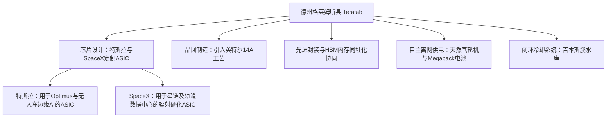

# 马斯克的1190亿美元终极算盘：起底“Terafab”垂直芯片豪赌与自由电子激光（FEL）技术大转折

2026年3月21日，在奥斯汀已停用的Seaholm发电厂，埃隆·马斯克揭晓了一项将他的“垂直整合”执念推向极致的宏大计划。SpaceX与特斯拉（Tesla）联手AI初创公司xAI，将在德克萨斯州格莱姆斯县（Grimes County）建造名为“Terafab”的超级半导体工厂。

该项目占地面积规划达1亿平方英尺，一期投资168亿美元，预计全部建成后总投资将飙升至1190亿美元。该设施的目标是将芯片设计、逻辑芯片制造、内存生产、先进封装及测试全部整合在同一个屋檐下。其终极愿景是实现每年超过1太瓦（1 TW）的AI算力产出，从而彻底绕过在地缘政治上脆弱的台积电（TSMC）供应链。然而，这一计划背后的工程挑战与财务风险同样堪称史诗级。

#### 架构之争：抛弃通用GPU，全面押注边缘与太空定制ASIC
与市面上主流的英伟达Blackwell等通用GPU路线不同，Terafab的芯片路线图完全聚焦于专用集成电路（ASIC）。马斯克旗下的企业需要针对两种截然不同的物理工作负载，打造高度定制化的硅片：

1. **物理AI边缘推理芯片（Physical AI Edge Inference）**：针对特斯拉Optimus人形机器人和Cybercab自动驾驶车队。此类芯片的瓶颈在于功耗与延迟，必须在低于100W的严格功耗预算内运行。这些ASIC依赖局部的稀疏矩阵数学计算加速，以实时处理摄像头和传感器阵列的数据流。
2. **辐射硬化太空计算芯片（Radiation-Hardened Space Compute）**：SpaceX正在为轨道AI卫星和星链（Starlink）数据路由设计定制ASIC，这部分需求预计将占到Terafab总产出的80%。太空计算对芯片的抗辐射性能提出了严苛要求，必须采用特殊的绝缘体上硅（SOI）或深度改良的CMOS架构，以抵御宇宙射线引发的单粒子翻转（SEU），并规避传统重型物理屏蔽手段带来的散热与载荷负担。

值得注意的是，尽管传奇芯片架构师吉姆·凯勒（Jim Keller）曾为特斯拉早期的自研芯片（HW3/HW4）奠定了技术基石，但他并未参与此次Terafab的建设。相反，凯勒创立的Fab2（前身为Atomic Semi）正在践行一种截然相反的理念：推广分布式、小型化、快速交付的模块化微型晶圆厂，这与Terafab这种单体、高度集中的超级晶圆厂模式形成了鲜明对比。

#### 光刻瓶颈：ASML的垄断铁幕与xLight的自由电子激光（FEL）大转折
对于任何想要大规模量产先进制程芯片的晶圆厂而言，极紫外光刻（EUV）都是绕不过去的坎。Terafab的设计产能目标是月产10万至100万片晶圆（WSPM）——在巅峰状态下，这相当于台积电总产能的68%。要维持如此庞大的吞吐量，需要一支极其庞大的EUV光刻机队。然而，目前全球EUV光刻机市场被荷兰巨头ASML独家垄断，其订单排期早已积压多年。

为了打破对ASML的绝对依赖，马斯克将目光投向了**自由电子激光（FEL）**光刻技术。他在X（原Twitter）上简短地写道：“FEL FTW（自由电子激光必胜）”，昭示了这一向粒子加速器光源转型的技术路线。

不同于ASML现有的激光等离子体（LPP）系统（通过高功率激光轰击锡滴产生EUV光），FEL技术利用波动器加速相对论电子束来产生极紫外光。由前英特尔CEO帕特·基辛格（Pat Gelsinger）担任执行主席的初创公司xLight，目前正在纽约阿尔巴尼纳米技术综合体（Albany Nanotech Complex）开发FEL原型机，预计将于2028年具备运行条件。该技术承诺带来三大突破：
* **更高的光源功率**：输出的EUV光源功率可达目前LPP系统的4倍；
* **更精准的波长**：具备向次2纳米（sub-2nm）及更先进制程延伸的物理潜力；
* **极致的成本效益**：单个FEL光源产生的极紫外光可同时分配给多台光刻扫描仪，从而大幅降低单片晶圆的均摊成本。

在工艺路线选择上，Terafab避开了从头研发专有制程的重重困难，而是计划引入**英特尔的14A工艺技术**，通过授权IP来完成具体的物理芯片制造步骤。

#### 资源与电网主权：彻底离网与水资源闭环
半导体晶圆厂是出了名的“吞电巨兽”和“用水大户”，普通的先进制程晶圆厂每天要消耗200万至1000万加仑的水。在德州格莱姆斯县，当地居民和监管机构最核心的担忧正是对本地地下含水层的过度开采。

为了平息环保争议，Terafab选址在已退役的吉本斯溪（Gibbons Creek）燃煤发电站旧址。工厂将直接从吉本斯溪水库（Gibbons Creek Reservoir）抽取工业冷却水，并部署了一套先进的多级水循环回收系统，力求实现超过90%的废水回收利用率。

此外，为了避免给原本就脆弱的德州电网（ERCOT）带来灾难性负担，Terafab将采用“完全离网”模式运行。该设施将依赖由现场天然气轮机驱动的专用微电网，并配备超大规模的特斯拉Megapack电池储能系统，用于日常的电网稳定与负荷平衡。

#### 资本支出硬着陆：垂直整合（IDM）神话的终极考验
从半导体行业的发展史来看，行业生态之所以从早期的垂直整合（IDM模式）演变为如今的设计与代工分离，根本原因在于尖端晶圆厂的资本开支（CapEx）已经膨胀到了单家企业无法承受的无底洞级别，这也直接催生了台积电等纯代工巨头的崛起。

行业分析机构SemiAnalysis的首席分析师戴兰·帕特尔（Dylan Patel）对马斯克的宏图提出了尖锐的质疑：
“特斯拉完全缺乏内部的芯片半导体制造IP。如果Terafab真的实现量产，它更有可能是一个使用授权工艺节点的‘整合工厂’，而非一个从头开发制程的开拓者。台积电 spent 数十年时间才将良率打磨到极致；良率是在长年累月的量产磨砺中‘喂’出来的。在英特尔14A工艺这种纳米级刀尖上起舞，无论砸下多少资金，也不可能在一夜之间买到高良率。”

如果Terafab最终成功，它将彻底重塑全球前沿科技的版图，为马斯克的科技帝国拼上绝对算力主权的最后一块拼图。但如果它沦为烂尾项目，巨大的资金消耗黑洞可能会危及特斯拉和SpaceX的核心主业。
